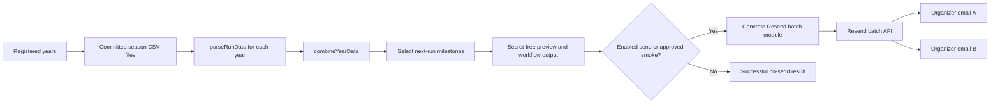
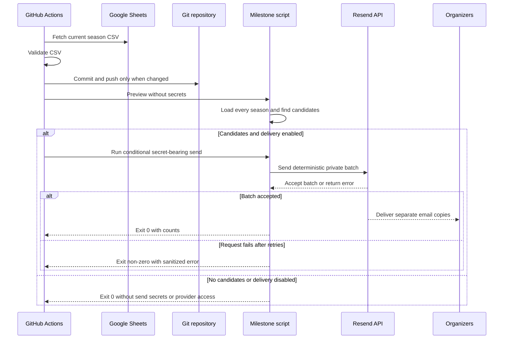
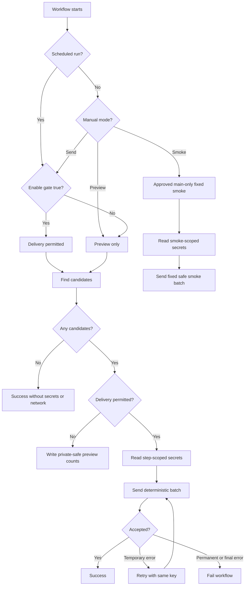

# Weekly Milestone Notifications - Plan

## Goal Capsule

Send a private Sunday email when one or more FCTC members are one recorded run away from an all-time multiple of 50.

The first version will use Resend and the existing weekly GitHub Actions workflow. It will reuse the committed CSV files and the dashboard's parser. It will not add a backend, database, or settings page.

Success means:

- The email lists each qualifying member and the next milestone.
- One email lists all qualifying members when the body is at most 64 KiB. An oversized digest fails closed.
- Every configured recipient gets a separate email.
- A week with no qualifying members sends no email.
- A delivery request failure makes the workflow fail clearly.
- Recipient addresses and API credentials never enter the repository or public logs.

---

## Product Contract

### Actors

- **A1 — Organizer:** Receives the weekly milestone email.
- **A2 — Operator:** Configures Resend, the sender, and the recipient list.
- **A3 — Member:** Appears in the email when their next recorded run is a milestone.

### Requirements

#### Milestone detection

- **R1:** Read every year registered in `src/config/years.js` and use exact all-time attendance totals.
- **R2:** A member qualifies when `totalRuns + 1` is a positive multiple of 50.
- **R3:** Detect 50th, 100th, 150th, 200th, and all later multiples of 50 without a fixed limit.
- **R4:** Treat the exact CSV header text as the member identity across years.
- **R5:** Sort candidates by milestone, then by normalized member name.

#### Weekly email

- **R6:** Run the check on Sunday after the current Google Sheet sync and push steps.
- **R7:** Send one plain-text digest when at least one candidate exists.
- **R8:** Include only each candidate's name, milestone, the target week, and the data cutoff date.
- **R9:** Send a separate copy to each configured recipient to keep recipient addresses private.
- **R10:** Normal preview and send paths make no Resend call when no candidate exists. The explicit fixed smoke mode is the only exception.
- **R11:** Send the candidate again next Sunday if they remain one recorded run from the milestone.

#### Operations

- **R12:** Scheduled runs send automatically when the notification gate is enabled. Manual runs do not send unless an approved operator selects a send mode.
- **R13:** Treat an accepted Resend request as workflow success. Do not claim that this proves inbox delivery.
- **R14:** Retry only temporary network and provider failures. Fail after the bounded retry limit.
- **R15:** Keep provider credentials and recipients in a GitHub Environment named `milestone-production` that permits only `main`.
- **R16:** Log counts, mode, week, accepted item count, sanitized provider status, and a fixed error category. Do not log names, addresses, message bodies, provider IDs, or raw responses.
- **R17:** Keep scheduled and normal manual delivery behind a default-off repository variable named `MILESTONE_EMAIL_ENABLED`.
- **R18:** Permit manual send and smoke modes only on the default branch and only when `github.actor` is `cpdis`.
- **R19:** Treat member names as untrusted email content. Reject control, line-separator, and bidirectional override characters before formatting.

### Acceptance examples

| Current runs | Next run | Result |
|---:|---:|---|
| 0 | 1 | Do not include |
| 48 | 49 | Do not include |
| 49 | 50 | Include as 50th |
| 50 | 51 | Do not include |
| 99 | 100 | Include as 100th |
| 149 | 150 | Include as 150th |
| 249 | 250 | Include as 250th |

Additional acceptance cases:

- Bundle two qualifying members into the same digest content.
- Send the same content separately to each configured recipient.
- Skip all Resend calls in normal preview and send modes when the candidate list is empty. The fixed smoke mode is the sole exception.
- Preview a manual run without reading secrets or sending email.
- Require an explicit manual mode before a manual run sends email.
- Keep scheduled delivery disabled until the rollout checks pass.
- Send a member again next week when their recorded count has not changed.

### Scope boundaries

The first version does not include:

- SMS or Twilio.
- A dashboard settings page.
- User accounts or recipient self-service.
- General run reminders.
- Alerts after a milestone is completed.
- Notification history or suppression state.
- A database, queue, webhook receiver, or provider abstraction.
- Open tracking, click tracking, or delivery analytics in the site.
- Alias mapping for member names across seasons.

---

## Planning Contract

### Current system

The dashboard is a static React and Vite site. It has no server or database. The Sunday workflow already fetches and validates the current CSV. It then commits and pushes changed data.

The existing code provides the core data path:

- `src/config/years.js` registers every season.
- `src/utils/dataParser.js` parses each CSV.
- `combineYearData()` creates exact all-time member totals.
- `.github/workflows/weekly-data-sync.yml` owns the Sunday sync.

This feature will extend that path after the push step. It will not duplicate attendance parsing.

### Key technical decisions

#### KTD1. Use Resend email for the first channel

Resend has the lowest total setup cost for this use case. Its free tier includes 3,000 recipient emails each month and 100 each day. It also gives production access after domain verification without a separate approval process. See [Resend pricing](https://resend.com/docs/knowledge-base/what-is-resend-pricing), [account limits](https://resend.com/docs/knowledge-base/account-quotas-and-limits), and [production access](https://resend.com/docs/knowledge-base/does-resend-require-production-approval).

SMS adds cost and sender registration work in Australia. Twilio lists Australian SMS at $0.0515 per segment and a clean mobile number at $8.25 each month. Australian sender rules also require registration for alphanumeric sender IDs. See [Twilio Australia pricing](https://www.twilio.com/en-us/sms/pricing/au), [Twilio Australia guidelines](https://www.twilio.com/en-us/guidelines/au/sms), and [Twilio's ACMA registration notice](https://help.twilio.com/articles/46266521342747).

Email is also a better fit for a digest with several names. SMS segment limits can make one digest become several billed messages.

#### KTD2. Extend the existing Sunday workflow

Use `.github/workflows/weekly-data-sync.yml` as the only scheduler. Run notification detection after the fetch and commit/push steps. This ensures that the script reads the newest validated data.

Do not add a Vercel function or a second scheduled service. The site stays static.

#### KTD3. Reuse the registered years and all-time parser

Load each path in `YEARS`, parse it with `parseRunData()`, and merge the results with `combineYearData()`. Detect milestones from `memberTotals`.

Member names must remain stable across season headers. A renamed header creates a separate member total. Document this invariant instead of adding an alias system before a real mismatch exists.

#### KTD4. Use the Resend REST batch endpoint

Use Node 24 built-in `fetch`. Do not add the Resend SDK, React Email, or another template dependency.

Call `POST https://api.resend.com/emails/batch`. Create one batch item for each recipient. The items use identical subject and text content. This keeps addresses private and uses one HTTP request. Resend permits up to 100 batch items. See the [batch email API](https://resend.com/docs/api-reference/emails/send-batch-emails) and [Email API introduction](https://resend.com/docs/api-reference/introduction).

Set these request headers:

- `Authorization: Bearer <RESEND_API_KEY>`
- `Content-Type: application/json`
- A stable `User-Agent` for this repository
- `Idempotency-Key: fctc-milestones/<week-start>`

#### KTD5. Make the request deterministic

Use `Australia/Perth` for the schedule and all week calculations. Sunday targets the next Monday. Monday through Saturday target the Monday at the start of the current week. This rule keeps a delayed Sunday job in the intended week when it starts after midnight.

Make the payload deterministic:

- Sort candidates by milestone and name.
- Trim, deduplicate, and sort recipients.
- Use a fixed subject and body format.
- Derive the idempotency key from that Perth Monday date.

Resend keeps idempotency keys for 24 hours. The same key and payload returns the original result. A changed payload with the same key returns HTTP 409. A rerun after 24 hours can send a duplicate. This limit is accepted because persistent history would add a database or committed state. See [Resend idempotency](https://resend.com/docs/dashboard/emails/idempotency-keys).

#### KTD6. Keep secrets narrow

Create a GitHub Environment named `milestone-production`. Restrict its deployment branch to `main`. Store these environment secrets:

- `RESEND_API_KEY`: A sending-only key restricted to the verified domain.
- `MILESTONE_RECIPIENTS`: A comma-separated list of organizer email addresses.
- `MILESTONE_SMOKE_RECIPIENT`: Colin's email address for the fixed provider smoke test.

Use this workflow configuration value:

- `MILESTONE_FROM`: `FCTC Milestones <runs@notifications.fctc.cpd.dev>`

Verify `notifications.fctc.cpd.dev` in Resend through Cloudflare DNS before enabling scheduled sends. Follow the [domain setup](https://resend.com/docs/dashboard/domains/introduction) and [API key](https://resend.com/docs/dashboard/api-keys/introduction) guides.

Add `MILESTONE_EMAIL_ENABLED` as a repository variable. Leave it false until rollout completes. Use it as the durable kill switch without disabling the CSV sync.

Run milestone detection in a step with no secrets. Inject secrets only into a later conditional send or smoke step. A preview or no-candidate run must never receive them. Restrict manual send and smoke modes to `cpdis` on `main`. GitHub masks matching values, but the script must still avoid printing secrets or derived private data. See [GitHub Actions secrets](https://docs.github.com/en/actions/concepts/security/secrets).

#### KTD7. Use a plain-text digest

Do not add a template system. Use plain text similar to this:

```text
Subject: FCTC milestone runs — week of 17 Aug 2026

2 runners are one recorded run from a milestone:

- Jane Doe — 100th run
- Sam Lee — 150th run

Based on FCTC attendance recorded through 16 Aug 2026.
```

Use correct singular and plural grammar. Disable Resend open and click tracking for the sending domain.

Derive the data cutoff from the newest parsed run with recorded attendance. Do not use the workflow start date. Fail closed if candidates exist but no valid cutoff exists.

#### KTD8. Bound retries and expose failures

Use a 10-second request timeout and no more than three attempts. Reuse the same payload and idempotency key for each attempt. Cap any `Retry-After` delay at 30 seconds.

Retry:

- Network failures and timeouts.
- HTTP 408.
- HTTP 429, using `Retry-After` when present.
- HTTP 5xx.
- HTTP 409 only when Resend reports concurrent idempotent processing.

Do not retry invalid credentials, an unverified domain, validation errors, permanent HTTP 4xx, or a changed-payload idempotency conflict. Use bounded backoff with jitter. See [Resend API errors](https://resend.com/docs/api-reference/errors) and [rate limits](https://resend.com/docs/api-reference/rate-limit).

Accept success only when the response has one valid provider ID for each requested batch item. Missing, extra, or malformed items are failures. Do not log those IDs.

After the final failure, print a sanitized status and fixed error category. Then exit non-zero. The data push can already be complete at this point. Retry manually during the same target week. After 24 hours, inspect Resend before retrying because an ambiguous failure can already have queued the email. Do not send a past-week digest automatically.

### Provider comparison

Prices and service limits below are a 14 August 2026 research snapshot. Recheck them before implementation if work starts much later.

| Option | Current entry point | Setup cost | Fit for this feature | Decision |
|---|---|---|---|---|
| Resend | 3,000 recipient emails/month free; 100/day | Verify one domain and create one key | Small API, batch send, request idempotency | **Use** |
| Postmark | 100 emails/month free; paid plan starts at $15/month | Account approval can add friction | Excellent transactional email, but no request idempotency | Do not use |
| Brevo | 300 emails/day free; paid plans start near $9/month | Larger marketing and CRM surface | Works, but adds more product surface than needed | Do not use |
| Amazon SES | Very low usage price | AWS identity, IAM, sandbox exit, and DNS work | Cheapest at scale, not simplest at this scale | Do not use |
| Twilio SMS | $0.0515/segment plus number costs | Australian sender registration and phone formatting | Short urgent alerts, not a multi-name digest | Defer |

Sources: [Postmark pricing](https://postmarkapp.com/pricing/), [Brevo plans](https://help.brevo.com/hc/en-us/articles/208589409-About-Brevo-s-pricing-plans), and [Amazon SES pricing](https://aws.amazon.com/ses/pricing/).

### High-level technical design

The prose in this plan is authoritative. These diagrams summarize the same design.







### Risks and controls

| Risk | Impact | Control |
|---|---|---|
| A member name changes between years | The all-time total splits into two people | Keep sheet headers stable. Add an alias only after a verified mismatch. |
| Resend accepts but does not deliver | The workflow looks successful while an inbox rejects mail | State that success means accepted. Check the Resend dashboard during rollout. |
| A manual rerun occurs after 24 hours | The same weekly email can send twice | Document the limit. Require the explicit manual send mode. |
| Resend changes its unversioned API | The script fails | Test the request contract with mocked responses. Fail clearly in production. |
| The public repository becomes inactive for 60 days | GitHub can disable the scheduled workflow | Keep `workflow_dispatch` and document the GitHub limitation. See [scheduled workflow limits](https://docs.github.com/en/actions/reference/workflows-and-actions/events-that-trigger-workflows#schedule). |
| A scheduled and manual run overlap | Two runs can race | Add workflow concurrency with `cancel-in-progress: false`. Do not start a manual send while a scheduled run is queued or active. |
| Secrets leak through logs | Recipient privacy or provider access is exposed | Scope secrets to one step. Never log names, addresses, content, or raw responses. |
| The verified domain is not ready | Resend rejects production recipients | Complete DNS verification and a controlled send before enabling the schedule. |
| Scheduled delivery activates before setup | The first run fails or sends to the wrong people | Keep `MILESTONE_EMAIL_ENABLED` false until all go/no-go checks pass. |
| A bad email address or member name injects content | Email output is malformed or misleading | Validate recipients and untrusted names with fixed limits before formatting or sending. |

---

## Implementation Units

### U1. Add pure milestone selection and digest formatting

**Goal:** Create deterministic, testable business logic with no provider or workflow dependency.

**Requirements:** R1–R5, R7–R8, R11, R19

**Dependencies:** None.

**Files:**

- Create `src/utils/milestones.js`.
- Create `src/utils/milestones.test.js`.
- Reference `src/utils/dataParser.js`.

**Approach:**

- Add `findUpcomingMilestones(memberTotals)`.
- Include a member when `totalRuns + 1 > 0` and `(totalRuns + 1) % 50 === 0`.
- Return `{ name, currentRuns, milestone }`.
- Sort by `milestone`, then by normalized name with a fixed locale.
- Add date helpers that calculate the next Monday-to-Sunday week in `Australia/Perth`.
- Add a formatter that returns a fixed subject and plain-text body.
- Keep names unchanged in message content. Normalize only for sorting.
- Reject control characters, Unicode line separators, and bidirectional override characters in names.
- Limit each name to 200 Unicode characters and the final UTF-8 body to 64 KiB.
- Derive the cutoff from the newest parsed run whose `totalAttendance` is greater than zero.
- Inject the clock into date helpers for deterministic tests.

**Test scenarios:**

- Cover 0, 48, 49, 50, 98, 99, 149, 199, and 249 runs.
- Cover two candidates with the same milestone.
- Cover candidates at different milestones.
- Preserve punctuation and emoji in member names.
- Produce stable sorting and byte-for-byte stable content.
- Use correct singular and plural grammar.
- Calculate the Perth week across Sunday, delayed Monday, month-end, and year-end boundaries.
- Fail on unsafe or oversized names and an oversized body without including the value in the error.
- Fail when candidates exist but no valid attendance cutoff exists.
- Confirm that unchanged data produces the same candidate next week.

**Verification:**

- Run `npm test -- src/utils/milestones.test.js`.

### U2. Add the Node notification script

**Goal:** Load all registered CSVs, select candidates, and preview or send one private batch.

**Requirements:** R1–R5, R7–R11, R13–R16, R19

**Dependencies:** U1.

**Files:**

- Create `scripts/send-milestone-digest.js`.
- Create `scripts/send-milestone-digest.test.js`.
- Create `scripts/lib/resendBatch.js`.
- Create `scripts/lib/resendBatch.test.js`.
- Reference `src/config/years.js`.
- Reuse `src/utils/dataParser.js`.

**Approach:**

- Keep file loading, mode selection, and GitHub summaries in the CLI script.
- Keep HTTP, timeout, retry, and response validation in the concrete Resend batch module.
- Do not create a general provider interface.
- Support `--preview`, `--send`, and `--smoke` modes. Default to `--preview`.
- Resolve only the paths registered in `YEARS` under `public/data/`.
- Reject missing files, malformed registered paths, year and filename mismatches, duplicate paths, and parse failures.
- Fail the whole check when any registered season fails. Never calculate from a partial season set.
- Read each CSV with `node:fs/promises`.
- Parse each year with `parseRunData()` and merge with `combineYearData()`.
- In preview and send modes, exit 0 before provider validation when no candidate exists.
- In preview mode, write the target week and candidate count to the job summary. Write a `has_candidates` step output for workflow conditions.
- In send mode, validate `RESEND_API_KEY`, `MILESTONE_RECIPIENTS`, and `MILESTONE_FROM`.
- In smoke mode, send fixed safe content only to `MILESTONE_SMOKE_RECIPIENT`. Do not accept custom smoke content or recipients.
- Use a separate `fctc-milestones-smoke/<Perth-date>` idempotency namespace and a `[TEST]` subject for smoke email.
- Trim, validate, deduplicate case-insensitively, and sort recipient addresses.
- Accept conservative single-mailbox addresses only. Reject display names, whitespace, CR, LF, NUL, addresses over 254 bytes, and empty list items.
- Reject zero recipients and more than 100 recipients.
- Create one batch item per recipient. Put only that address in its `to` field.
- Use the same content in every item.
- Use the Monday date in the idempotency key.
- Implement the timeout and retry policy from KTD8.
- Parse provider errors into safe categories. Do not print response bodies.
- Require one valid returned ID for each submitted batch item. Treat missing, extra, malformed, or invalid JSON success responses as failures.
- Inject `fetch`, clock, and sleep into the Resend module for tests.
- Write a GitHub job summary with week, candidate count, recipient count, mode, and accepted item count.

**Test scenarios:**

- Load and merge two registered year fixtures.
- Fail closed when any registered season is missing, duplicated, malformed, or cannot parse.
- Exit before reading send configuration when no candidates exist in preview or send mode.
- Preview candidates without a network request.
- Parse, trim, deduplicate, validate, and sort recipients.
- Reject invalid, injected, oversized, or empty recipients without printing the value.
- Build one private batch item per recipient.
- Build fixed smoke content and a separate smoke key without reading candidate data.
- Keep the payload and idempotency key stable across retries.
- Accept only a valid success response with one ID per recipient.
- Reject missing, extra, malformed, and non-JSON success responses.
- Retry a timeout, 408, 429, 5xx, and concurrent 409.
- Honor `Retry-After` within the bounded wait policy.
- Do not retry 401, 403, 422, or changed-payload 409 responses.
- Stop after three attempts.
- Keep names, addresses, content, API keys, and raw responses out of stdout and stderr.

**Verification:**

- Run `npm test -- scripts/send-milestone-digest.test.js`.
- Run `node scripts/send-milestone-digest.js --preview` against the committed data.

### U3. Extend the weekly GitHub Actions workflow

**Goal:** Run detection after the Sunday sync and make manual sends explicit.

**Requirements:** R6, R10, R12, R14–R18

**Dependencies:** U2.

**Files:**

- Modify `.github/workflows/weekly-data-sync.yml`.

**Approach:**

- Add the `milestone-production` environment, restrict it to `main`, and attach the workflow job to it.
- Change the schedule to an off-minute Sunday time in `Australia/Perth`.
- Use Sunday 17:17 local time unless club operations require a different time.
- Add `timezone: Australia/Perth` to the schedule entry.
- Add a `workflow_dispatch` choice input named `notification_mode`. Use `preview` as the default, with `send` and `smoke` as explicit choices.
- Add workflow concurrency. Use one stable group and `cancel-in-progress: false`.
- Add `actions/setup-node@v6` with Node 24.
- Pin GitHub-owned actions to reviewed commit SHAs and keep readable version comments.
- Run `npm ci --ignore-scripts` before the script because the existing parser imports PapaParse.
- Keep the notification steps after `Commit + push if changed`.
- Run `--preview` first without secrets and expose `has_candidates`.
- Run `--send` for scheduled runs only when the gate is true and candidates exist.
- Run `--send` for manual runs only when the gate is true, candidates exist, the mode is `send`, the ref is `main`, and the actor is `cpdis`.
- Run `--smoke` only when the manual mode is `smoke`, the ref is `main`, and the actor is `cpdis`. The gate can remain false.
- Provide `RESEND_API_KEY` and `MILESTONE_RECIPIENTS` only to the normal send step.
- Provide `RESEND_API_KEY` and `MILESTONE_SMOKE_RECIPIENT` only to the smoke step.
- Provide `MILESTONE_FROM` as non-secret workflow configuration.
- Keep `contents: write` as the only workflow permission.
- Report disabled, preview, no-op, smoke, accepted, and failed states without private data.

GitHub now supports timezone-aware schedules. It still warns that scheduled runs can be delayed during high load. See [schedule syntax](https://docs.github.com/en/actions/reference/workflows-and-actions/events-that-trigger-workflows#schedule), [workflow syntax](https://docs.github.com/en/actions/reference/workflows-and-actions/workflow-syntax), and [setup-node v6](https://github.com/actions/setup-node).

**Test scenarios:**

- A scheduled event previews and skips delivery while the gate is false.
- A scheduled event sends when the gate is true and candidates exist.
- A manual event defaults to preview mode.
- A manual `send` event needs the gate, `main`, `cpdis`, and candidates.
- A manual `smoke` event uses fixed content, `main`, and `cpdis`, but not the gate.
- An unauthorized actor or non-main ref cannot reach a secret-bearing step.
- An unchanged CSV still reaches the notification step.
- A fetch or push failure prevents notification execution.
- A no-candidate run succeeds without send secrets.
- A provider failure fails the job after the data push.
- Concurrent manual and scheduled runs queue instead of cancelling one another.

**Verification:**

- Review the rendered workflow in GitHub Actions.
- Run a manual dispatch with `notification_mode=preview`.
- Confirm the summary shows preview mode and no provider request.

### U4. Configure Resend, document operations, and enable delivery

**Goal:** Complete the one-time provider setup and prove one controlled delivery.

**Requirements:** R6–R19

**Dependencies:** U3.

**Files:**

- Modify `README.md`.

**Approach:**

- Create or use Colin's Resend account.
- Add `notifications.fctc.cpd.dev` as a sending domain.
- Add the Resend DNS records to Cloudflare.
- Wait for Resend to show the domain as verified.
- Disable open and click tracking for the domain.
- Create a sending-only, domain-scoped API key.
- Add `RESEND_API_KEY` to the `milestone-production` environment.
- Add `MILESTONE_RECIPIENTS` to the `milestone-production` environment.
- Add `MILESTONE_SMOKE_RECIPIENT` to the environment with Colin's address.
- Set `MILESTONE_FROM` to `FCTC Milestones <runs@notifications.fctc.cpd.dev>` in the workflow.
- Document how to add or remove a recipient by changing the secret.
- Document the exact-name invariant, Sunday timing, manual preview, manual send, no-candidate behavior, accepted-versus-delivered meaning, 24-hour duplicate limit, and GitHub's inactivity limit.
- Run the complete test and build suite.
- Keep `MILESTONE_EMAIL_ENABLED` false.
- Run a production-data preview and save the expected week and candidate count.
- Run the fixed `smoke` mode. It must contain no attendance data and send only to Colin.
- Confirm workflow acceptance, Resend dashboard status, inbox receipt, and clean public logs.
- Add the intended organizer recipients.
- Set `MILESTONE_EMAIL_ENABLED` true only after every go/no-go check passes.

**Test scenarios:**

- Domain verification passes.
- The restricted API key can send from the configured sender.
- The manual preview makes no provider request.
- A fixed smoke email reaches Colin's inbox without using the weekly key.
- Recipient addresses do not appear in public Actions logs.
- The normal committed data sends nothing when no candidate exists.
- The first enabled Sunday run matches the saved candidate and recipient counts.

**Verification:**

- Run `npm test`.
- Run `npm run build`.
- Run `node scripts/send-milestone-digest.js --preview`.
- Run a manual GitHub Actions preview.
- Run one fixed manual smoke send.
- Inspect the public job log for private data.
- Confirm the delivered subject and body match the tested formatter.

**Go/no-go and activation:**

- Keep the gate false if tests or the build fail.
- Keep the gate false until Resend shows the domain as verified and tracking as disabled.
- Keep the gate false until the restricted key, sender, and all recipient addresses are verified.
- Keep the gate false until preview, smoke receipt, and public-log inspection pass.
- After activation, save the expected target week, candidate count, and recipient count before the first Sunday.
- Within 15 minutes of completion, compare those values with the workflow summary and Resend accepted count.
- Check delivery and bounce status the next morning.
- Set the gate false after any count mismatch, failure, bounce, complaint, privacy leak, or incorrect content.

**Disable and recovery:**

- Set `MILESTONE_EMAIL_ENABLED` false first.
- Cancel any queued or running notification workflow because an already evaluated step can continue.
- Revoke the Resend key only after suspected leakage or when an in-flight send cannot otherwise be stopped.
- Revert notification code later if needed. Preserve the CSV sync workflow.
- Do not restore data because this feature stores no state.
- An accepted email cannot be recalled. Send a correction if its content is wrong.

---

## Verification Contract

### Automated verification

Run these commands from the repository root:

```bash
npm test
npm run build
node scripts/send-milestone-digest.js --preview
git diff --check
```

The tests must cover milestone boundaries, all-time merging, deterministic content, recipient privacy, retry rules, no-candidate behavior, and log sanitization.

### Manual verification

1. Keep `MILESTONE_EMAIL_ENABLED` false.
2. Run `workflow_dispatch` with `notification_mode=preview`.
3. Confirm the workflow completes without receiving send secrets.
4. Confirm the job summary contains counts but no member names or addresses.
5. Run `workflow_dispatch` with `notification_mode=smoke` as `cpdis` on `main`.
6. Confirm Resend accepted one smoke item.
7. Confirm the `[TEST]` email arrives at Colin's address with no attendance data.
8. Confirm public logs do not contain names, addresses, content, credentials, IDs, or raw responses.
9. Add and validate the intended recipient list.
10. Set `MILESTONE_EMAIL_ENABLED` true.
11. Before the first Sunday, save the preview week, candidate count, and recipient count.
12. After the run, confirm the live values match and zero candidates create no Resend batch.
13. Recheck Resend delivery and bounce status the next morning.

### Failure verification

- Use mocked tests for 401, 403, 408, 409, 422, 429, 500, timeout, and malformed responses.
- Confirm temporary errors retry with the same payload and key.
- Confirm permanent errors fail without extra attempts.
- Confirm three failed attempts produce a non-zero exit.
- Confirm a provider failure does not undo an already completed data push.
- Confirm a manual retry within 24 hours uses the same weekly key.
- Inspect Resend before any retry after 24 hours.

---

## Definition of Done

### Feature behavior

- [ ] The script uses every registered season and exact all-time attendance.
- [ ] A current count of 49, 99, 149, or any later `50n - 1` qualifies.
- [ ] One digest lists all current candidates.
- [ ] Each recipient receives a separate copy.
- [ ] A no-candidate week sends nothing.
- [ ] A member can appear again next week when their count stays unchanged.

### Operations and privacy

- [ ] Scheduled runs send after the weekly data sync.
- [ ] Manual runs default to preview.
- [ ] Scheduled and normal manual sends remain disabled until the enable gate is true.
- [ ] Manual send and smoke modes require `cpdis` on `main`.
- [ ] Resend uses a verified subdomain and a restricted key.
- [ ] Recipients and credentials exist only in the `milestone-production` environment, which permits only `main`.
- [ ] Public logs contain no member names, addresses, message content, credentials, or raw responses.
- [ ] Tracking is disabled for the sending domain.
- [ ] Temporary failures retry safely with one idempotency key.
- [ ] Permanent and final failures fail the workflow clearly.

### Quality and documentation

- [ ] Unit tests cover all milestone boundaries and notification branches.
- [ ] `npm test` passes.
- [ ] `npm run build` passes.
- [ ] `git diff --check` passes.
- [ ] A controlled manual email reaches Colin.
- [ ] The first scheduled run and next-morning delivery check pass.
- [ ] The README explains setup, recipients, schedule, manual operation, failure behavior, and known limits.
- [ ] No SMS, backend, database, settings UI, template framework, or unused dependency is added.
