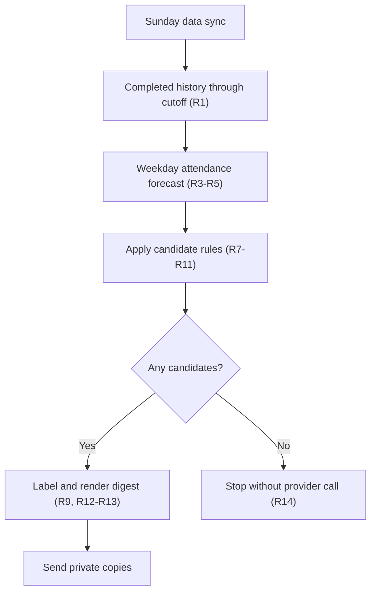
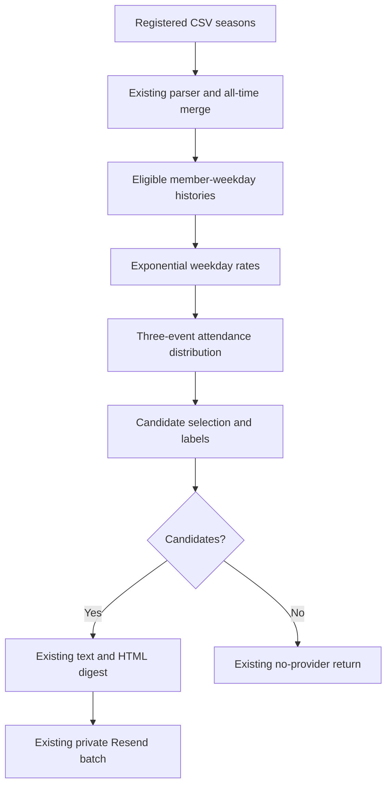

# Milestone Attendance Forecast - Plan

## Goal Capsule

- **Objective:** Identify FCTC members who are likely to reach an all-time multiple of 50 during the next Monday, Wednesday, and Friday runs, while keeping the exact one-run-away guarantee.
- **Product authority:** Colin owns the forecast rules and the private Sunday milestone email.
- **Execution profile:** Standard code change with test-first proof, no new dependency, and no workflow or data-store change.
- **Stop conditions:** Stop if implementation needs new product rules, changes the private delivery boundary, or requires attendance app files.
- **Tail ownership:** Run the focused and full verification gates, open one forecast-only PR, and watch CI to a decided state.
- **Open blockers:** None.

---

## Product Contract

### Summary

Extend the existing pure milestone utility and Sunday digest path with a dependency-free weekday attendance forecast.
Keep the current delivery, privacy, schedule, and zero-candidate boundaries.

### Problem Frame

The current detector includes only a member whose next recorded run is a multiple of 50.
It misses a predictable member who needs two or three runs and is likely to attend enough of the coming week's runs.

FCTC attendance has useful weekday patterns.
Recent changes can also make old attendance less representative, so recent same-weekday observations need more influence than older observations.

### Key Decisions

- **Use a balanced forecast.** (session-settled: user-directed — chosen over conservative and broad forecasts: a 50 percent threshold catches useful candidates without making the digest noisy.) Governs R7 and R8.
- **Use recency-weighted weekday history.** (session-settled: user-directed — chosen over a fixed recent window and equal weighting: use all available evidence while adapting to routine changes.) Governs R4 and R5.
- **Keep the exact one-run-away guarantee.** (session-settled: user-directed — chosen over applying the probability threshold to every candidate: preserve the dependable behavior already in production.) Governs R7.
- **Show plain confidence labels.** (session-settled: user-directed — chosen over exact percentages: make the email easy to scan without implying false precision.) Governs R9 and R12.
- **Forecast a fixed Monday, Wednesday, and Friday week.** (session-settled: user-directed — chosen over manual schedule input and an external schedule source: keep operations simple.) Governs R3. **Conflict call-out:** The CSV contains future dated rows, but this rule intentionally does not use them to set the forecast opportunity count.

<!-- ce-section: work-relationships -->
### How This Work Fits Together

This plan owns forecast selection and the forecast details shown in the milestone digest.
The broader breakdown is the current understanding, not a committed roadmap.

- **Depends on:** The private weekly email, Sunday data sync, recipient controls, and delivery safeguards in `docs/plans/2026-08-14-001-feat-weekly-milestone-notifications-plan.md`.
- **Extends:** The existing exact one-run-away detector with forecast candidates.
- **Can proceed independently of:** The iOS attendance app work, which is not active scope for this plan.

### Actors

- A1. **Organizer:** Receives one private Sunday digest when at least one member qualifies.
- A2. **Operator:** Maintains the existing email configuration and can disable scheduled delivery.
- A3. **Member:** Appears in the digest when the recorded data meets the candidate rules.
- A4. **Notification workflow:** Syncs the attendance data, calculates the forecast, and sends or skips the digest.

### Requirements

**Forecast source and horizon**

- R1. Use all completed run records from every registered season through the current attendance cutoff.
- R2. Forecast each member's next positive multiple of 50 without a fixed milestone limit.
- R3. Treat the next Monday, Wednesday, and Friday as the three forecast opportunities for the target week.
- R4. Derive a separate attendance likelihood for each member and each forecast weekday from completed same-weekday opportunities since that member's first recorded attendance, with more weight on recent observations.
- R5. Calculate the chance that the member records at least the runs needed for the milestone during the three opportunities in R3.
- R6. Keep the forecast deterministic for the same attendance data, target week, and configuration.

**Candidate selection and labels**

- R7. Include every member who is exactly one recorded run from the next milestone, regardless of forecast chance.
- R8. Include a member who needs two or three runs only when the forecast chance in R5 is at least 50 percent.
- R9. Label a qualifying member `Very likely` at 80 percent or higher, `Likely` at 50 percent or higher but below 80 percent, and `Possible` when R7 includes a member below 50 percent.
- R10. Exclude a member who needs more runs than the three opportunities in R3.
- R11. Treat a missing weekday estimate as no forecast chance for that opportunity, while still applying R7.

**Digest and delivery**

- R12. Show each candidate's name, milestone, plain confidence label, and runs needed without showing an exact percentage.
- R13. Keep the existing target week, attendance cutoff, branded HTML, plain-text fallback, candidate sort, private per-recipient delivery, and content safety rules.
- R14. Make no provider call and send no email when no member qualifies.
- R15. Recalculate the digest each Sunday without adding notification history or suppression state.

### Key Flows

- F1. **Sunday forecast and send**
  - **Trigger:** The existing Sunday data sync completes.
  - **Actors:** A1, A3, A4
  - **Steps:** Load completed attendance through the cutoff, estimate weekday attendance, calculate each reachable milestone chance, apply the candidate rules, render one digest, and deliver private copies.
  - **Outcome:** Recipients get one digest when at least one member qualifies.
  - **Covers:** R1-R13, R15
- F2. **No qualifying member**
  - **Trigger:** Candidate selection returns zero members.
  - **Actors:** A4
  - **Steps:** Stop before email credentials or provider delivery are used.
  - **Outcome:** The workflow succeeds without sending an email.
  - **Covers:** R14



### Acceptance Examples

| ID | Given | Expected result | Covers |
|---|---|---|---|
| AE1 | Alex has 149 recorded runs and a 98 percent forecast chance. | Include `Alex 👑 — 150th run — Very likely · needs 1 run`. | R7, R9, R12 |
| AE2 | A member has 148 recorded runs and a 74 percent forecast chance. | Include the 150th milestone as `Likely · needs 2 runs`. | R8, R9, R12 |
| AE3 | A member has 147 recorded runs and a 19 percent forecast chance. | Exclude the member. | R8 |
| AE4 | A member has 149 recorded runs and a 40 percent forecast chance. | Include the next milestone as `Possible · needs 1 run`. | R7, R9, R12 |
| AE5 | A member needs three runs and has an 80 percent forecast chance. | Include the next milestone as `Very likely · needs 3 runs`. | R8-R10, R12 |
| AE6 | No member meets R7 or R8. | Send no email and make no provider call. | R14 |
| AE7 | Three members qualify for different milestones. | Put all three in one digest and send a private copy to each configured recipient. | R12, R13 |
| AE8 | The CSV contains future dated rows. | Exclude them from attendance history and keep the fixed three-opportunity horizon in R3. | R1, R3 |

### Success Criteria

- A Sunday total of 149 for Alex produces the 150th-run line in AE1.
- A member who needs two or three runs and meets the 50 percent threshold appears in the digest with a label and runs-needed count.
- The forecast adapts faster to recent same-weekday attendance changes than an equal-weight all-history rate.
- The current no-candidate path still completes without an email provider call.
- The email remains useful without exposing exact forecast percentages.

### Scope Boundaries

This plan does not add:

- Machine learning, a database, or stored notification history.
- Manual run-count or attendance-probability overrides.
- An external schedule source or schedule settings.
- Exact probability values in the email.
- New recipients, channels, providers, or dashboard settings.
- Changes to the iOS attendance app.

### Dependencies and Assumptions

- The registered CSV data remains the attendance source of truth.
- The attendance cutoff separates completed attendance from future dated rows.
- The normal weekly schedule has one Monday, one Wednesday, and one Friday opportunity.
- A cancelled run or a special schedule can make the fixed horizon less accurate.
- Recent weighting reduces lag after a routine change, but it cannot remove uncertainty.

### Sources and Research

- `src/config/years.js` registers the 2025 and 2026 seasons.
- `src/utils/dataParser.js` provides dated run attendance, weekday values, and all-time member totals.
- `src/utils/milestones.js` contains the current exact one-run-away detector and digest formatting.
- `.github/workflows/weekly-data-sync.yml` runs the Sunday sync and notification jobs.
- `public/data/2026.csv` contains completed attendance and future dated run rows.
- The 2026-08-14 data snapshot gives Alex 👑 147 recorded runs and no other member within three runs below a milestone.

---

## Planning Contract

**Product Contract preservation:** Product Contract unchanged. The two planning questions about recency decay and sparse history are resolved below without a scope change.

### Current System

`src/utils/milestones.js` owns milestone selection, Perth week dates, attendance cutoff, deterministic sorting, candidate safety, and digest formatting.
`scripts/send-milestone-digest.js` loads all registered seasons and is the sole production caller of milestone selection.
The script already receives all-time runs, member totals, and the target week before it chooses whether to stop, preview, or send.

The existing preview output is the workflow delivery gate.
The provider credentials remain outside the preview step, and a zero-candidate send exits before it reads secrets.

### Key Technical Decisions

- KTD1. **Separate numeric forecast math from milestone orchestration.** Add a small `src/utils/milestoneForecast.js` module for boolean-history weighting and the three-event distribution. Keep history eligibility, candidate selection, safety, and digest behavior in `src/utils/milestones.js`. Neither module reads CSV files, dates from the environment, email state, or workflow state. Governs U1 and U2.
- KTD2. **Use a finite exponential weighted rate per weekday.** Sort each eligible same-weekday history newest-first and assign age zero to the newest opportunity. Use weight `2^(-age / 8)` and divide the weighted attendance sum by the finite weight sum. (session-settled: user-directed — chosen over a fixed recent window and equal weighting: retain all history while adapting to routine changes.) Governs R4-R6 and U1.
- KTD3. **Use a three-event Poisson-binomial calculation.** Build the exact distribution of zero through three attendances from the three weekday rates, then sum the states at or above the runs needed. This keeps the calculation dependency-free and supports different weekday rates. Governs R5-R11 and U1.
- KTD4. **Extend the current candidate contract.** Add runs needed, the internal forecast chance, and the derived confidence label to each candidate. Compare selection and label thresholds against the raw chance before any test-only rounding. Keep the existing milestone-and-name sort and validate all formatter inputs. Governs R9-R13 and U1-U2.
- KTD5. **Preserve the delivery and smoke boundaries.** Calculate the cutoff once, use forecast-qualified candidates for `has_candidates`, and leave the workflow gate unchanged. Keep smoke content fixed and independent from attendance data. Governs R13-R15 and U2.

### High-Level Technical Design



The forecast calculation stays independent from `Date`, `Intl`, environment values, and email delivery.
Only history eligibility uses parsed calendar dates and the injected attendance cutoff.

For a member and weekday, let age zero be the newest eligible opportunity and increase age by one for each older opportunity.
The weekday rate uses this directional formula:

```text
weight(age) = 2 ^ (-age / 8)
weekday rate = sum(weight * attended) / sum(weight)
```

The three weekday rates feed a four-state distribution for zero, one, two, or three attendances.
Each weekday updates the states from high attendance counts to low counts so one event contributes once.
Candidate selection then applies R7-R11.

### Assumptions

- **Half-life calibration:** Eight same-weekday opportunities is the initial half-life. It reproduces the accepted Alex examples when applied to the current data and rounds to about 19 percent at 147, 74 percent at 148, and 98 percent at 149.
- **No sparse-history smoothing:** A weekday with at least one eligible opportunity uses the finite weighted rate without a prior. A weekday with no estimate contributes zero per R11.
- **Conditional independence:** The three weekday attendance events are treated as independent after the separate weekday rates are known. This is a useful approximation, not a claim that a member's weekly decisions are unrelated.
- **Completed opportunity:** Use a valid dated run with recorded club attendance, on or after the member's first recorded attendance, and on or before the inclusive cutoff.

### Sequencing

1. Implement and prove the pure forecast and candidate contract.
2. Integrate the candidate contract into text, HTML, preview, send, and fixed smoke paths.
3. Update the operator documentation after the behavior is verified.

### Risks and Mitigations

| Risk | Impact | Mitigation |
|---|---|---|
| The weighted rate is a heuristic, not a calibrated probability. | A label can sound more certain than the data supports. | Show only the labels in R9 and keep exact values out of the email. |
| Attendance decisions can be correlated across one week. | The independence assumption can overstate or understate the reach chance. | Keep the model visible in this plan and use the balanced threshold rather than stronger certainty language. |
| A cancelled run leaves fewer than three opportunities. | A member can appear when the milestone is no longer reachable that week. | Preserve the fixed horizon chosen in R3 and document this known limit. |
| Future or incomplete rows enter the parser. | Forecast history can leak future data or count a non-run as an absence. | Apply the inclusive cutoff and completed-opportunity filters before weighting. |
| A formatter change reaches the fixed smoke path. | The smoke email can fail even though no forecast data is available. | Give the fixed smoke candidate literal label and runs-needed values and retain run-scoped idempotency. |
| A false positive exposes a private member name to the email provider and recipients. | The message cannot be recalled after delivery. | Reconcile every pre-merge preview candidate to source rows, retain private batch items, and keep the provider-free no-candidate path. |

### Operational and Rollback Notes

**Pre-merge go/no-go**

- Run the production-data preview twice against the same CSV snapshot and require identical candidate counts.
- Inspect each local candidate through the pure selector without adding names or chances to workflow logs.
- Reconcile the current total, cutoff, first-attendance boundary, weekday histories, milestone, runs needed, label, and selection reason to the source rows.
- When the preview has no candidates, reconcile Alex's source histories and require the pure selector to reproduce the accepted 19, 74, and 98 percent calibration at totals 147, 148, and 149.
- Do not merge when identical previews differ or a candidate cannot be traced through the completed rows at or before the cutoff.
- Do not use smoke or manual send as forecast validation.

**First live Sunday**

- Before the schedule, confirm the operator can set `MILESTONE_EMAIL_ENABLED=false` immediately.
- If there are no candidates, require a successful workflow summary with `no-candidates` and no Resend request.
- If candidates exist, require the accepted item count to equal the configured recipient count.
- Inspect one organizer copy for the expected names, milestones, labels, runs-needed text, plain-text fallback, and absence of exact chances.
- Disable the gate before the next schedule after a workflow failure, count mismatch, data mismatch, future-row leak, privacy failure, or exact chance leak.
- Do not rerun a live send to investigate an unexpected result.

**Rollback**

- Disable `MILESTONE_EMAIL_ENABLED` first so future schedules cannot send.
- Revert the forecast selection and digest-copy change to the prior one-away-only behavior.
- Run the provider-free preview and full verification gates before restoring scheduled delivery.
- No data restore is needed because this plan adds no stored state.
- A delivered email cannot be recalled. Containment applies only to future sends.

### Sources and Research

- `src/utils/milestones.js`, `src/utils/milestones.test.js`, `scripts/send-milestone-digest.js`, and `scripts/send-milestone-digest.test.js` define the current selection, formatting, preview, send, and smoke patterns.
- `src/utils/dataParser.js` provides the dated attendance rows and exact member totals.
- `docs/solutions/integration-issues/smoke-test-idempotency-must-be-run-scoped.md` requires fixed data-free smoke content and separate weekly and smoke idempotency keys.
- [NIST exponential smoothing guidance](https://www.itl.nist.gov/div898/handbook/pmc/section4/pmc43.htm) supports exponentially decreasing weights when recent observations need more influence.
- [Poisson-binomial distribution research](https://arxiv.org/abs/1702.01326) defines the sum of independent Bernoulli events with different success rates.
- [GitHub Actions schedule documentation](https://docs.github.com/en/actions/reference/workflows-and-actions/workflow-syntax#onschedule) confirms the existing IANA timezone schedule shape.

---

## Implementation Units

### U1. Build the weekday forecast engine

**Goal:** Replace exact one-away-only selection with a pure, deterministic forecast candidate selector.

**Requirements:** R1-R11, F1, AE1-AE5, AE8

**Dependencies:** None.

**Files:**

- Create `src/utils/milestoneForecast.js`.
- Modify `src/utils/milestones.js`.
- Create `src/utils/milestoneForecast.test.js`.
- Modify `src/utils/milestones.test.js`.

**Approach:**

1. Implement boolean-history weighting and the numeric attendance distribution in the dependency-free module from KTD1.
2. Derive the next positive multiple of 50 and runs needed from each valid member total.
3. Build eligible Monday, Wednesday, and Friday histories per the completed-opportunity assumption.
4. Apply KTD2-KTD3, then apply R7-R11 and return the candidate contract in KTD4.
5. Reuse the existing safe-name boundary and deterministic candidate sort.

**Execution note:** Start with failing pure-function tests for the forecast boundary and the accepted Alex examples.

**Patterns to follow:**

- Follow the injected-data and deterministic-sort patterns in `src/utils/milestones.test.js`.
- Keep `src/utils/milestoneForecast.js` numeric, side-effect free, and unaware of parsed run objects.

**Test scenarios:**

- Prove that age zero has weight 1, age eight has weight 0.5, and older observations retain non-zero weight.
- Prove that recent absences lower the weighted rate below the equal-weight mean and recent attendance raises it above that mean.
- Reject a non-boolean history value, a non-finite weekday rate, and a runs-needed value outside one through three.
- Return a weekday rate in the inclusive range from zero through one, and return no rate for an empty history.
- Prove that Monday, Wednesday, and Friday histories do not affect each other's rates.
- Ignore an invalid date, a date after the cutoff, a row before first attendance, and a row without recorded club attendance.
- Treat the cutoff date and the first-attendance date as inclusive.
- Return no weekday estimate when no eligible opportunity exists, then apply R11.
- Calculate all eight combinations of attendance and absence across three supplied weekday rates without losing or double-counting a state.
- Covers AE1-AE3. Use fixed Alex-shaped weekday rates and assert the unrounded one-, two-, and three-run chances within a small numeric tolerance.
- Covers AE4. Include an exact one-away member below 50 percent and label the candidate `Possible`.
- Include a two- or three-away member at exactly 50 percent and exclude the same member just below 50 percent.
- Label 80 percent as `Very likely` and a value just below 80 percent as `Likely`.
- Exclude members who need more than three runs and support milestones above 200.
- Keep candidate order stable by milestone and normalized member name.
- Ignore invalid totals and reject unsafe included names without echoing private content.

**Verification:** `src/utils/milestoneForecast.test.js` proves the numeric model. `src/utils/milestones.test.js` proves history eligibility, thresholds, labels, safety, and deterministic order.

### U2. Integrate forecast candidates into the digest

**Goal:** Use forecast candidates in preview and send modes and show their plain labels and runs needed in both email formats.

**Requirements:** R12-R15, F1-F2, AE6-AE8

**Dependencies:** U1.

**Files:**

- Modify `src/utils/milestones.js`.
- Modify `src/utils/milestones.test.js`.
- Modify `scripts/send-milestone-digest.js`.
- Modify `scripts/send-milestone-digest.test.js`.

**Approach:**

1. Calculate the attendance cutoff once and pass runs, totals, and cutoff into the U1 selector.
2. Validate the extended candidate fields before text or HTML generation.
3. Replace one-away-only copy with the confidence label and runs-needed copy from R12.
4. Keep the exact forecast chance internal and absent from text, HTML, logs, and workflow summaries.
5. Add fixed label and runs-needed values to the data-free smoke candidate without invoking the forecast.
6. Preserve the existing `has_candidates`, preview, secret access, provider, sorting, size, and idempotency paths.

**Execution note:** Prove the no-candidate secret and provider short-circuit before changing the send integration.

**Patterns to follow:**

- Reuse the direct formatter tests and byte-stability checks in `src/utils/milestones.test.js`.
- Reuse dependency injection and safe-log assertions in `scripts/send-milestone-digest.test.js`.

**Test scenarios:**

- Render one and several candidates with correct singular or plural `run` wording in plain text and HTML.
- Render `Very likely`, `Likely`, and `Possible` with runs needed while omitting exact percentages from all content.
- Keep milestone number, member name escaping, white background, inline styling, text fallback, and deterministic byte output.
- Reject an invalid confidence label or runs-needed value before content generation.
- Covers AE6. Return before secret reads and provider calls when forecast selection yields no candidates.
- Covers AE7. Send identical combined content as one private batch item per configured recipient.
- Covers AE8. Exclude a retained future parsed row from forecast history.
- Preserve preview output, safe count-only logs, and provider-free preview behavior.
- Assert that the internal numeric chance never appears in preview or send logs, validation errors, or workflow summary values.
- Preserve fixed smoke content, attendance-data independence, and run-scoped smoke idempotency after formatter validation changes.
- Preserve the 64 KiB text limit and 256 KiB HTML limit with the longer candidate copy.

**Verification:** Focused utility and script tests prove the full data-to-digest path without a live provider call.

### U3. Document forecast behavior and operations

**Goal:** Make the README match the forecast rules and the unchanged operating boundary.

**Requirements:** R1-R15 and the Product Contract Scope Boundaries

**Dependencies:** U1 and U2.

**Files:**

- Modify `README.md`.

**Approach:**

1. Replace the `50n - 1` selection description with the fixed weekday horizon, recency-weighted history, thresholds, labels, and exact one-away guarantee.
2. State that confidence labels are heuristic and that the fixed horizon can be wrong during cancelled or special weeks.
3. Keep the existing preview, activation, recipient, provider, privacy, retry, and recovery instructions.
4. State that a zero-candidate preview or send creates no Resend request.

**Test scenarios:** Test expectation: none -- this unit changes operator documentation only.

**Verification:** The README agrees with the tested behavior and contains no new setup or secret.

---

## Verification Contract

| Gate | Command | Proves | Units |
|---|---|---|---|
| Forecast model | `npm test -- src/utils/milestoneForecast.test.js src/utils/milestones.test.js` | Weighting, history eligibility, combined chance, thresholds, labels, and sorting | U1 |
| Timezone independence | `TZ=UTC npm test -- src/utils/milestoneForecast.test.js src/utils/milestones.test.js` | Weekday bucketing, cutoff and first-attendance boundaries, and numeric forecast do not depend on the machine timezone | U1-U2 |
| Digest integration | `npm test -- src/utils/milestones.test.js scripts/send-milestone-digest.test.js` | Text, HTML, CLI, preview, send, smoke, privacy, and no-send behavior | U2 |
| Workflow regression | `npm test -- scripts/weekly-workflow.test.js` | The existing schedule, gate, authorization, and secret boundaries remain valid | U2 |
| Full regression | `npm test` | The complete dashboard and notification suite remains green | U1-U3 |
| Production build | `npm run build` | The shared browser module still bundles for the dashboard | U1-U3 |
| Production-data preview | `node scripts/send-milestone-digest.js --preview` | Registered CSV data loads, forecast selection completes, and no provider call occurs | U1-U3 |
| Diff quality | `git diff --check` | The final patch has no whitespace errors | U1-U3 |

Do not run `--send`, `--smoke`, or a manual GitHub workflow during implementation verification.
No new test email is part of this plan.

---

## Definition of Done

### Global

- The artifact remains `artifact_readiness: implementation-ready` with no launch-blocking question.
- Every active requirement and acceptance example is covered by an implementation unit and verification evidence.
- The forecast remains dependency-free and deterministic for the same attendance snapshot and cutoff.
- The existing recipient privacy, secret boundary, email provider behavior, schedule, and enable gate remain unchanged.
- A zero-candidate run makes no provider call and sends no email.
- The final diff contains no attendance app file, and verification follows the no-live-email boundary in the Verification Contract.
- Focused tests, the full suite, the production build, production-data preview, and diff check pass.
- Remove abandoned experiments, unused helpers, stale parameters, and superseded one-away-only copy.

### Per Unit

- U1 is done when the forecast tests prove history eligibility, half-life weighting, three-run chance, thresholds, labels, safety, and deterministic order.
- U2 is done when text, HTML, preview, send, and fixed smoke tests prove the extended candidate contract without weakening any delivery safeguard.
- U3 is done when the README describes the live forecast and unchanged operating steps.
