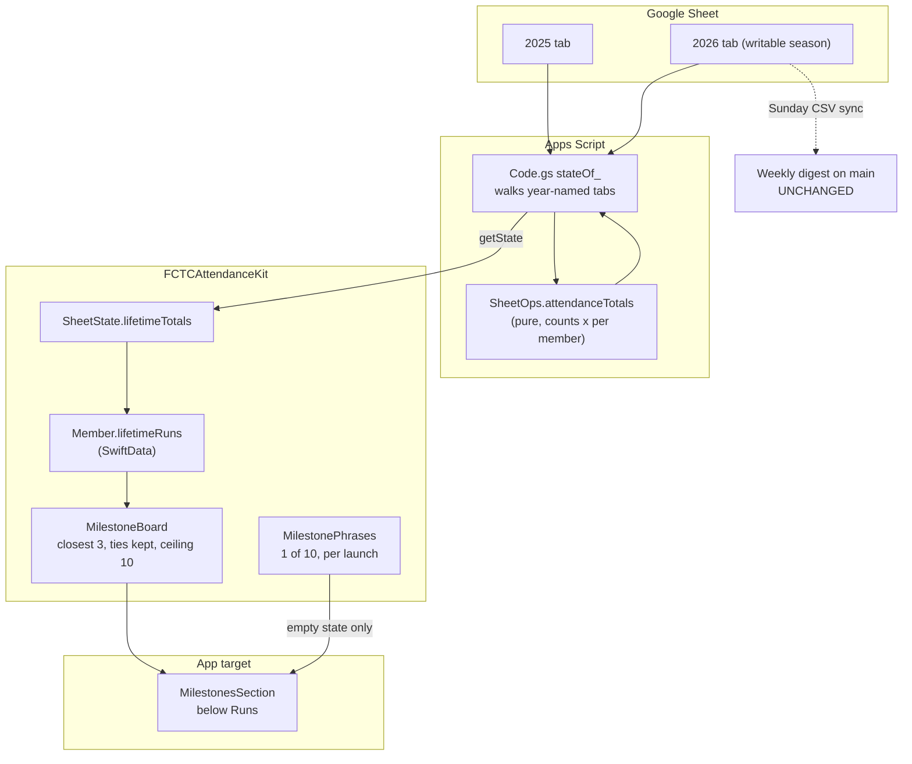

# feat: Milestones section in the attendance app

## Summary

Add a passive section headed **Milestones** below Runs on the attendance app's
home screen, listing the people closest to their next multiple of 50 runs. The
app gets lifetime run totals live from Apps Script, which reads every year-named
tab rather than only the current season.

The weekly milestone email is untouched. The app is the passive place to look;
the email stays the active weekly nudge.

---

## Problem Frame

The dashboard already computes milestones and emails a weekly digest, but that
lives entirely in GitHub Actions on `main` and is invisible from the phone. The
attendance app is where people actually are on a run morning, and it has no idea
who is close to a landmark.

The blocker is data, not display. `getState` reads one tab, named by the
`SEASON_SHEET_NAME` script property, so the app can only ever see the current
season. Milestones are lifetime counts spanning 2025 and 2026, so nothing in the
app can currently derive them.

---

## Requirements

- **R1.** The app shows the people closest to their next positive multiple of 50,
  below the Runs section on the home screen, under the heading `Milestones`.
- **R2.** Each row shows the person, how many runs they need, and the milestone
  they are heading for. No probability or likelihood wording.
- **R3.** The list shows the closest 3 people, never splits a tie, and excludes
  anyone needing more than 10 runs. A tie at the third position shows everyone
  tied there.
- **R4.** When nobody qualifies, the section shows one of ten fixed Seuss-style
  lines, chosen at random once per app launch, avoiding an immediate repeat of
  the previous launch's line.
- **R5.** Run totals are lifetime, counted across every season tab, and agree
  with attendance the user recorded moments earlier.
- **R6.** The section renders from cache on a cold offline launch.
- **R7.** No notification of any kind, and no new Settings control.
- **R8.** The section is always present, including before the app has ever
  synced. With no data it shows the empty state rather than hiding.

---

## Key Technical Decisions

**KTD1. Season tabs are discovered by name, not configured.**
`SEASON_SHEET_NAME` keeps naming the one writable tab. Lifetime counting instead
walks every tab whose name is four digits. A new season needs no second config
change, and the write surface is unchanged: totals are a read, and no new code
path can write outside the season band.

**KTD2. Totals ride on `getState` rather than a new action.**
The frozen contract gains one additive field, `lifetimeTotals`, on an existing
response. Older app builds ignore an unknown key, so a deployed script stays
compatible with build 2 in the field. A separate action would have meant a second
round trip on every refresh for data the home screen always wants.

**KTD3. The shortlist is computed in the kit, not in Apps Script.**
Apps Script returns raw totals; `FCTCAttendanceKit` decides who makes the list.
The rule in R3 is presentation policy and will get fiddled with, and changing it
in Swift is a TestFlight build rather than a script redeploy against the live
sheet.

**KTD4. No forecast, in either direction.**
The weighted-attendance model on `main` stays email-only and is not ported. The
app's plain "needs N runs" is a different, simpler claim. The two surfaces will
often differ in a given week, which is expected. As of 2026-08-16 the email's
3-run cut catches Alex 👑 alone, while the app would show Alex plus Celeste and
Claire, who are both 5 away.

**KTD5. Totals cache on the existing `Member` model.**
Lifetime totals are per member and arrive with the roster, so they belong on
`Member` rather than in a new model. This satisfies R6 for free through the
existing SwiftData cache.

---

## High-Level Technical Design

The two paths never meet. The email keeps reading published CSVs in GitHub
Actions; the app reads the sheet live. They share only the definition of a
milestone, which is small enough to state twice.

---

## Implementation Units

### U1. Count lifetime attendance in SheetOps

**Goal:** A pure function that turns one tab's raw grid into per-member run counts.

**Requirements:** R5

**Dependencies:** none

**Files:**
- `apps-script/SheetOps.js` (modify)
- `apps-script/test/sheetops.checks.js` (modify)

**Approach:** Add `attendanceTotals(grid)` returning `[{ name, runs }]`. Reuse
`sheetGeometry` for the header row and band, `isRunRow` to skip non-run rows, and
**`isAttendedMark` for the attendance test**. Do not write a strict `x` check:
the real sheet records attendance as `x`, as a per-person distance like `12.30`,
and occasionally as `🛕` or free text, with `-` meaning explicitly absent.
`isAttendedMark` already encodes that, and it matches the dashboard's predicate
in `src/utils/dataParser.js`, so the app and the email agree on totals. Also add
`isSeasonTabName(name)`, true for exactly four digits, so Code.gs has no naming
logic of its own. Both stay pure and grid-only, with no `SpreadsheetApp` reference.

**Patterns to follow:** the existing pure helpers in `apps-script/SheetOps.js`,
particularly `memberBand` and `sheetGeometry`, and their fixture-driven tests.

**Test scenarios:**
- A grid from the 2025 fixture returns a count per member matching a hand-tally
  of that column's marks.
- A blank cell does not count and a `-` does not count.
- A numeric cell such as `12.30` DOES count, matching how distances are recorded
  in place of a tick on the real sheet.
- A non-Latin mark such as `🛕` and free text such as `no run` both count, since
  only `-` and blank mean absent.
- A member with zero attendance appears with `runs: 0` rather than being absent.
- A grid with no recognisable header row returns an empty array rather than
  throwing.
- Rows below the run band, such as trailing summary rows, do not inflate counts.
- `isSeasonTabName` accepts `2025` and `2026`, rejects `Sheet1`, `2026 copy`,
  `202`, and the empty string.

**Verification:** `node --test apps-script/test` passes, including a case that
tallies a known member against the committed season fixture.

---

### U2. Return lifetime totals from getState

**Goal:** `getState` carries per-member lifetime run counts across all seasons.

**Requirements:** R5

**Dependencies:** U1

**Files:**
- `apps-script/Code.gs` (modify)
- `apps-script/README.md` (modify)
- `apps-script/test/api.checks.js` (modify)
- `apps-script/test/support/` (modify, the sheet fake needs multiple tabs)

**Approach:** Extend `stateOf_` with a `lifetimeTotals` array of
`{ name, runs }`. Enumerate the spreadsheet's sheets, keep those passing
`isSeasonTabName`, read each one's grid, and sum `attendanceTotals` per member
name across tabs. Members are matched on the existing `normalizeKey` so a person
in both seasons totals once. Existing `withSheet_` still resolves the single
writable season and is untouched, keeping the write surface exactly as it was.

The API contract header in `apps-script/Code.gs` and the contract note in
`docs/plans/packets/_conventions.md` both record this as an additive field.

**Patterns to follow:** `stateOf_` for response shape; the multi-tab read should
sit alongside the existing read helpers rather than inside `withSheet_`.

**Test scenarios:**
- `getState` against a two-tab fake returns totals summed across both tabs.
- A member present only in the older tab still appears with their total.
- A member present in both tabs appears once, with the seasons added together.
- A spreadsheet with only the current tab returns totals equal to that tab alone.
- Non-year tabs, for example a `Notes` tab, contribute nothing.
- The rest of the `getState` payload is byte-identical to before, so roster,
  runs, `seasonYear` and `sheetRevision` are unaffected.
- `sheetRevision` does not change when only an unrelated older tab changes,
  preserving the existing conflict semantics.

**Verification:** `node --test apps-script/test` passes. A manual `getState`
against the real deployment returns totals matching a spot-check of the 2025 and
2026 tabs for two members.

---

### U3. Decode and cache lifetime totals

**Goal:** The app stores lifetime totals so the section survives a cold offline launch.

**Requirements:** R5, R6

**Dependencies:** U2

**Files:**
- `ios/FCTCAttendanceKit/Services/SheetAPI.swift` (modify)
- `ios/FCTCAttendanceKit/Models/Member.swift` (modify)
- `ios/FCTCAttendanceKit/Services/SyncEngine.swift` (modify)
- `ios/FCTCAttendanceKitTests/ServiceTests.swift` (modify)

**Approach:** Add `lifetimeTotals: [MemberTotal]` to `SheetState`, defaulting to
empty so a script that has not been redeployed still decodes. Add
`lifetimeRuns: Int` to `Member`, defaulted to zero for the existing store. The
roster apply path in `SyncEngine` writes the total alongside the column index.

**Patterns to follow:** the existing optional-tolerant decoding in
`SheetAPI.swift`, and the roster apply path in `SyncEngine.swift`.

**Test scenarios:**
- A JSON payload carrying `lifetimeTotals` decodes with the totals attached.
- A payload with no `lifetimeTotals` key decodes with an empty array rather than
  throwing, which is the deployed-build-2 case.
- A payload with a total for an unknown name is ignored rather than creating a
  phantom member.
- Refreshing state updates an existing member's `lifetimeRuns` in place instead
  of duplicating the member.
- A member absent from `lifetimeTotals` keeps a zero total rather than a stale one.

**Verification:** the kit suite passes and a refresh against a fixture leaves
`Member.lifetimeRuns` populated.

---

### U4. The milestone shortlist and its phrases

**Goal:** Pure policy deciding who appears, and which line shows when nobody does.

**Requirements:** R1, R2, R3, R4

**Dependencies:** U3

**Files:**
- `ios/FCTCAttendanceKit/ViewModels/MilestoneBoard.swift` (create)
- `ios/FCTCAttendanceKit/ViewModels/MilestonePhrases.swift` (create)
- `ios/FCTCAttendanceKitTests/MilestoneTests.swift` (create)

**Approach:** `MilestoneBoard.shortlist(from:)` maps members to
`{ name, runs, milestone, runsNeeded }`, drops anyone above the 10-run ceiling,
sorts by runs needed then name, takes the closest 3, then extends to include
anyone tied with the third. Members with zero lifetime runs are excluded, since
someone who has never run is not approaching their fiftieth.

`MilestonePhrases` holds the ten fixed lines and exposes
`next(avoiding:using:)` taking a `RandomNumberGenerator` so tests are
deterministic. The previous index persists in `UserDefaults` and a redraw avoids
an immediate repeat. Selection happens once at launch and is held on the runtime,
never computed in a view body.

**Patterns to follow:** the pure view-model style of
`ios/FCTCAttendanceKit/ViewModels/AttendanceInsights.swift` on `main`, and the
injectable-seam convention used by `RunReminderService`.

**Test scenarios:**
- Today's real shape: lifetime totals of 147, 45, 45 and 140 yield Alex 👑 at 3
  away plus Celeste and Claire tied at 5, and exclude Col, who sits exactly on
  the ceiling at 10 but is cut by the closest-3 cap.
- The ceiling is inclusive at its edge in exactly one direction, so a member
  needing 10 is eligible and one needing 11 is not.
- A tie at the third position returns 4 rows rather than cutting one arbitrarily.
- A tie spanning the first three positions returns exactly those three.
- Someone on a exact multiple of 50 needs 50 for the next one, not zero.
- A member with zero lifetime runs never appears.
- Nobody within the ceiling returns an empty shortlist.
- Ordering is stable for equal distances, sorted by name, so the list does not
  reshuffle between refreshes.
- `next(avoiding:)` with a seeded generator returns a known index.
- `next(avoiding:)` never returns the avoided index, across every possible draw.
- With no previous index stored, any of the ten is allowed.

**Verification:** the kit suite passes with the fixture reproducing the
2026-08-16 sheet totals.

---

### U5. Render the section

**Goal:** The list appears below Runs on the home screen.

**Requirements:** R1, R2, R4, R7, R8

**Dependencies:** U4

**Files:**
- `ios/FCTCAttendance/Views/MilestonesSection.swift` (create)
- `ios/FCTCAttendance/Views/HomeView.swift` (modify)
- `ios/FCTCAttendance/AppRuntime.swift` (modify)
- `ios/FCTCAttendance/UITestSupport.swift` (modify)
- `ios/FCTCAttendanceUITests/FCTCAttendanceUITests.swift` (modify)

**Approach:** A separate view file, because `ios/FCTCAttendance/Views/HomeView.swift`
is already 555 lines and over the repo's roughly-500 guideline; `HomeView` gains
only the call site. The section is headed `Milestones` and is always rendered,
including before the first sync, where it falls through to the empty state
(R8). The runtime holds the launch-chosen phrase. Rows carry
`milestone-row-<name>` identifiers and the empty state carries
`milestone-empty`, matching the existing identifier convention.

Nothing here touches Settings, notifications, or `UNUserNotificationCenter`.

**Patterns to follow:** `summarySection` and `HomeRow` in
`ios/FCTCAttendance/Views/HomeView.swift`; the accessibility-identifier naming
used throughout the home screen.

**Test scenarios:**
- With fixture totals producing candidates, the section lists them below Runs in
  ascending runs-needed order.
- Each row states the runs needed and the target milestone, and contains no
  likelihood wording.
- With fixture totals producing no candidates, the empty state appears and one of
  the ten known lines is present.
- On a launch with no cached state at all, the section is still present and shows
  the empty state rather than being absent from the screen.
- Recording attendance that pushes someone under the ceiling makes them appear
  after the refresh, proving the live path end to end.
- The phrase does not change while navigating between home and a run and back,
  proving it is held rather than recomputed per render.
- Settings contains no milestone or notification control beyond the existing run
  reminders toggle.

**Verification:** the 9 existing UI tests still pass alongside the new ones, and
the app builds for release.

---

## Scope Boundaries

**In scope:** the Apps Script read path, the kit policy, and the home screen
section.

**Not in scope:**
- The weekly email. Schedule, recipients, forecast, and wording all stay as they
  are on `main`.
- The public dashboard's own presentation of milestones.
- Any change to what a milestone is.

### Deferred to Follow-Up Work

- Per-person notification channel preferences. Removed from this plan by the
  2026-08-16 decision that the app is passive. If it returns, the earlier
  finding stands: email addresses cannot live in the public repo or in the
  spreadsheet, which is shared link-viewable for the CSV export.
- Merging `main` into `feat/attendance-app`. This plan no longer needs it, since
  nothing here depends on the email system. It remains outstanding for its own
  reasons.

---

## Risks

**A slower `getState`.** Every refresh now reads two full tabs instead of one,
and grows with each season. Mitigation: totals are read-only and cached, so a
slow refresh degrades to a stale list rather than a broken one. If it becomes a
problem, the totals read can move behind its own action and a longer interval.

**Silent disagreement with the email.** Someone will notice the app naming people
the Sunday email did not. This is by design, per KTD4, but is worth saying once
in the section's own framing.

**Season-tab naming drift.** A tab named `2027 draft` would be skipped silently.
Mitigation: `isSeasonTabName` is strict and unit-tested, and the season rollover
step in `docs/plans/packets/U8-release-runbook.md` should note the naming
requirement.

---

## Verification Contract

- `node --test apps-script/test` passes.
- `npm test` passes, unchanged, proving the email path was not disturbed.
- The `FCTCAttendanceKit` scheme passes, with the new milestone tests.
- The `FCTCAttendance` scheme passes, with 9 existing UI tests plus the new ones.
- A manual `getState` against the live deployment returns lifetime totals that
  match a two-member spot check of the 2025 and 2026 tabs.

## Definition of Done

- The home screen shows a `Milestones` section below Runs with the closest 3
  people, ties intact, nobody beyond 10 runs.
- Recording attendance and refreshing moves someone in or out of the list without
  a restart.
- Killing the network and cold launching still renders the last known list.
- Nobody qualifying shows one of the ten lines, and relaunching usually changes
  it and never repeats the previous one.
- Settings gained no new control, and the app registers no new notifications.
- The weekly email is byte-identical in behaviour.

---

## Open Questions

None outstanding. Both prior questions were resolved on 2026-08-16: the heading
is `Milestones`, and the section stays visible before the first sync rather than
hiding (R8).

## Sources

- `apps-script/Code.gs`, `apps-script/SheetOps.js` for the frozen contract and
  the pure geometry seam.
- `src/utils/milestones.js` on `main` for the multiple-of-50 definition and the
  3-run email cut.
- `.github/workflows/weekly-data-sync.yml` on `main` for the untouched email path.
- Live `getState` and both season CSVs, measured 2026-08-16, for the real
  distribution behind the ceiling of 10.
