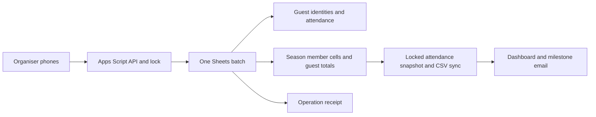
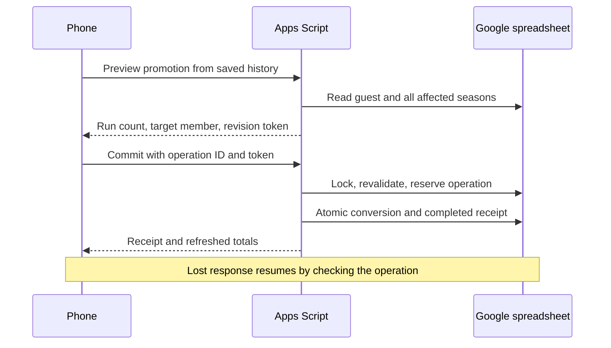
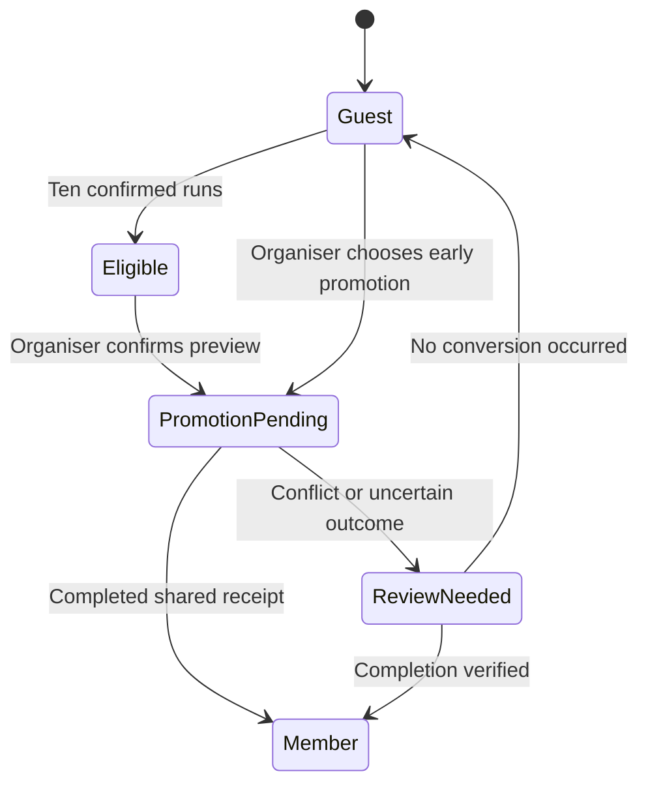

# Shared Guest Attendance and Member Credit - Plan

## Goal Capsule

- **Objective:** Every organiser can track returning guests, and each guest keeps all previous run credit when they become a member.
- **Means:** Shared records in the existing Google spreadsheet, followed by historical attendance conversion on promotion (KTD1, KTD4).
- **Authority:** Colin's 16 September requirements govern this feature. This plan supersedes the original local-only guest decision in `docs/plans/2026-08-14-001-feat-fctc-attendance-ios-app-plan.md`, Q2, and the corresponding U3 contract.
- **Execution:** Plan only in this session. Future implementation includes code, documentation, local tests, and verification on a spreadsheet copy. It does not authorise production writes, deployment, push, or TestFlight distribution.
- **Stop conditions:** Stop a migration or promotion before attendance changes if identity, guest allocation, historical row, or formula safety cannot be established.
- **Ownership:** The implementer completes the units and verification below. Colin approves production migration and release after reviewing the copy-sheet results.

---

## Product Contract

### Summary

Keep a shared list of guests and the runs they attended.
Organisers select returning guests without adding them to the member checklist.
Promotion credits the original runs to the member, including runs from earlier seasons.
A person with eleven recorded runs has eleven runs immediately after promotion.

### Problem Frame

The app saves guest names in local submission history, but the Guests screen does not restore them.
Other organisers cannot see that history.
The existing counter counts submissions, and current promotion credits only the open attendance draft.
These behaviours do not support the club's practice of keeping occasional visitors separate until they become regulars.

### Key Decisions

- **Shared guest history** (session-settled: user-directed — chosen over phone-local history so organisers use the same record). Governs R1, R2.
- **Full historical credit** (session-settled: user-directed — chosen over starting at one run when promoted). Governs R4, R5.

### Requirements

**Guest capture and history**

- R1. Store guest identities and confirmed attendance centrally, and show the same saved history on every authorised phone after refresh.
- R2. Keep guests separate from the main member list. Show each guest's confirmed distinct-run count and last attendance.
- R3. Restore named guests when reopening a saved run. Allow name corrections and assignments without requiring another attendance or distance change.

**Promotion and totals**

- R4. Promotion preserves all confirmed distinct runs, including previous seasons, in the member's normal attendance history.
- R5. Convert each credited guest attendance into member attendance exactly once. Preserve that run's headcount and distance.
- R6. Offer manual promotion when a guest reaches ten confirmed runs. Do not promote automatically or discard later guest attendance while awaiting promotion.
- R7. Count attendance once per person and run. Corrections, retries, duplicate imports, and two organisers recording the same person must not create extra credit.

**Sync, recovery, and existing records**

- R8. Keep offline attendance entry and show pending changes separately from confirmed totals. Promotion requires an online preview of saved history.
- R9. Preserve existing local names and pending submissions during upgrade. Import only reviewed attendance that can be linked to a real run and an existing guest allocation.
- R10. Keep iOS totals, historical CSVs, dashboard totals, and milestone calculations consistent after the next successful data sync.
- R11. Return an actionable conflict for ambiguous identities, missing runs, invalid allocations, or writes based on a guest's pre-promotion state. Do not guess or silently change totals.

### Acceptance Examples

- AE1. Covers R1, R2, R7: Colin records Rene on a run. Aaron refreshes and sees that run. Aaron records the same guest on that run; the count stays one.
- AE2. Covers R4, R5: Rene has eleven confirmed runs across two seasons. Promotion produces eleven member attendance marks, eleven lifetime runs, and unchanged headcounts on those runs.
- AE3. Covers R4, R6: Rene is promoted after ten runs. The next run raises the member total to eleven.
- AE4. Covers R3, R5, R9: A saved run has one unnamed guest. An organiser assigns Rene to that guest slot. The headcount stays unchanged and Rene gains one recorded run.
- AE5. Covers R5, R7, R8: The phone loses the promotion response. Reopening shows the same completed promotion or a pending verification state, without another column or guest decrement.
- AE6. Covers R8, R11: Aaron submits an offline draft that still treats promoted Rene as a guest. The app offers a reviewed conversion to member attendance, without restoring an obsolete guest count.
- AE7. Covers R8: Rene has ten saved runs and an unsaved eleventh. “Save run and promote” confirms that run first. Promotion then shows eleven; a queued run remains visibly pending.

### Scope Boundaries

Include shared identities, run history, safe promotion, local-history recovery, and historical export updates.
Keep the Google spreadsheet as the canonical record and the current Apps Script endpoint as the service boundary.
Do not add a separate hosted database or a new club administration website.

**Deferred to follow-up work:** Optional guest-name notes in the attendance cells, guest profile details, bulk identity-merging tools, and automatic promotion.
Notes may later improve spreadsheet readability; they are not required for shared history.

---

## Planning Contract

### Current Code and Constraints

- `ios/FCTCAttendanceKit/Models/PendingSubmission.swift` retains local names. A `done` record can also be a discarded or superseded conflict.
- `ios/FCTCAttendanceKit/ViewModels/ChecklistViewModel.swift` starts reopened drafts without names and ignores name-only edits in change detection.
- `ios/FCTCAttendanceKit/ViewModels/AttendanceInsights.swift` counts submissions with a threshold of three.
- `ios/FCTCAttendanceKit/Services/SyncEngine.swift` uses row-based caches and aggregate-count merge shortcuts. Promotion invalidates its assumption that guest counts only increase.
- `apps-script/Code.gs` calculates lifetime totals from member cells across four-digit season tabs. `src/utils/dataParser.js` derives member runs and kilometres from those same cells.
- `apps-script/Code.gs` already handles the right-edge member insertion problem. Inserting immediately before `+1's` alone does not reliably extend the sheet formulas.
- `.github/workflows/weekly-data-sync.yml` refreshes only 2026. Earlier-season backfills would otherwise remain absent from dashboard and email inputs.

### Assumptions

Ten runs is a promotion suggestion, not a hard membership rule.
An organiser may explicitly promote earlier or later.
Shared data appears on refresh and foreground sync; live push updates are unnecessary.
Shared guest history is for authorised organisers. Hidden tabs are organisational, not a privacy control; rollout must verify actual workbook access.
Unknown historical guest counts cannot establish who attended; organisers must supply or confirm that evidence.

### Key Technical Decisions

#### KTD1. Use small shared tables in the existing workbook

Implement R1, R2, and R7 with three reserved, non-year tabs: `_FCTC_Guests`, `_FCTC_GuestAttendance`, and `_FCTC_Operations`.
Hide them from ordinary sheet navigation and exclude them from season discovery and exports.

- Guests: stable guest UUID, display name, active/promoted state, linked canonical member name, and revision.
- Guest attendance: one logical record per guest UUID and run UUID, with season sheet ID, present/removed state, and guest/transferred classification.
- Operations: operation UUID, canonical request without credentials, request digest, source revisions, reproducible write plan or target state, reserved receipt location, and outcome. Outcomes distinguish pending, completed, definitively rejected, and reconciled non-application.

Names are editable labels, not identity keys.
Search may normalise names, but linking histories requires an explicit identity selection.
Retain promotion mappings and removed-attendance records so stale devices cannot recreate old identities or attendance silently.

Cell notes alone provide no dependable identity or promotion record.
A separate database would duplicate the workbook's authority.
The ledger choice follows those requirements directly; no alternative implementation experiment is needed before planning.

#### KTD2. Give runs stable, season-aware identity

Assign run UUIDs through row-associated Google developer metadata.
Use spreadsheet ID, season sheet ID, and run UUID on new cached records and queued writes.
Treat row index as a current coordinate, with date and run label as validation fields.
Metadata follows row movement; deletion removes it. Missing or duplicated metadata blocks automatic matching.

Bootstrap metadata on run rows in supported season tabs through an explicit, idempotent setup operation.
New runs receive metadata in their creation batch.
Use compact metadata only for locators, not attendance storage.
Preserve current member identity by canonical sheet name; guest UUIDs are a narrow exception to the old name-only rule.

[Google metadata behaviour and limits](https://developers.google.com/workspace/sheets/api/guides/metadata) support this choice.

#### KTD3. Extend the API with explicit guest semantics

Implement R3, R7, R8, and R11 through a versioned capability contract.
Keep legacy reads decodable. Add shared guest identities, counts, current-run guest assignments, stable run identifiers, and revisions to state responses.
Provide a guest-history read for dated runs across seasons. Open each history entry in the checklist for that exact season and run.

New mutations carry a stable operation UUID and request digest.
Add guest creation/rename, reviewed history import, promotion preview, promotion commit, and operation-status actions.
Attendance submissions carry named guest IDs and an explicit unnamed remainder.
The sheet's guest count is their sum.

A merge unions named IDs and takes the maximum unnamed remainder, preserving the existing conservative merge policy for anonymous counts.
An overwrite replaces those fields only against the reviewed revision.
“Name this guest” converts an existing unnamed slot; “Add guest” adds attendance.
Keep these actions distinct so assigning a name does not inflate the count.
Renaming a shared person changes their label everywhere. Correcting who attended one run uses a reviewed replacement or removal, with a guest-aware before/after diff and overwrite semantics.
After promotion, history corrections use the member attendance cells, not the transferred guest records.

Cover guest names, assignments, promotion mappings, and relevant season data in conflict detection.
Promotion preview returns a revision token for all affected history and season contexts.
A commit must validate that token again.

Reject stale pre-promotion guest payloads with a typed conflict.
Replace aggregate-count satisfaction and automatic rebase shortcuts where they could resurrect converted guests.
A replayed operation returns its receipt; a reused operation UUID with a different payload fails.

Create a new offline guest with a persisted provisional UUID. Queue identity creation before dependent attendance and keep both across restarts.
If the server finds plausible existing identities, park dependent attendance for the organiser to select a match or confirm a distinct person.
Replace provisional references with the selected shared ID before sending attendance; do not join same-name histories automatically.

#### KTD4. Promote by converting the original attendance rows

Implement R4 and R5 on the server, never by adjusting only a displayed total or adding a synthetic opening balance.
Promotion preview lists the target member name, affected seasons, historical run count, and validation problems.
The organiser explicitly chooses a new member or an existing member to link.
Never equate people solely because their names match.

Preflight every active guest attendance before any attendance change:

1. Resolve exactly one real run and validate the current guest allocation.
2. Confirm the target member identity across seasons and use one identical member header everywhere.
3. Plan any member-column insertions using the proven inside-band insertion and displaced-column relocation behaviour.
4. Set the member mark, reduce that run's guest count by one, and mark the guest allocation transferred.
5. Create the member in the active-season roster even when all guest history is in older seasons.

If that member is already marked on an affected run, stop for correction review.
That state may represent a prior duplicate, so preserving both credit and headcount cannot be assumed.
Preserve other guests, existing member marks, run distances, formulas, formatting, and notes.
Transferred records remain audit history; member cells become the authority for future corrections.

Use the saved-history sequence in AE7.
Do not let immediate roster insertion race ahead of saving the current run.

#### KTD5. Commit related changes together and retain receipts

Use the existing script lock for all cooperating mutations and consistent state reads.
Build one Sheets v4 `spreadsheets.batchUpdate` for each attendance conversion or promotion, including its completed receipt.
Use precise ranges and field masks.
The batch can span season tabs and the auxiliary tabs because they share one spreadsheet.

Reserve every mutation as pending before dispatch, with the recovery data in KTD1.
Use one workbook-wide pending-write fence. Every writer, including legacy add-member and add-run routes, must honour it.
If a result is uncertain, stop later writes and check the receipt. Structural changes can invalidate coordinates far beyond one guest.
State reads report pending verification; exports return busy until the outcome is known.
Do not automatically repeat a batch merely because a receipt is temporarily absent.
Reconciliation must work after both the script execution and originating phone have terminated. The phone shows “Checking saved changes”.
Release the fence only after a completed receipt or definitive non-application. An uncertain state remains fenced for operator recovery.
A definitive rejection changes no attendance and may be retried under the same operation protocol. A crash before dispatch must be distinguished from an uncertain dispatch before any reissue.

Preflight request size and execution limits. Fail before mutation if a promotion cannot fit one supported batch.
Do not split an atomic promotion into independent chunks.

The API guarantees atomic application of one valid batch, but the lock does not exclude people editing the sheet directly.
Require an edit-free window for initial setup, historical import, and promotion. Re-read and verify postconditions before reporting success.
Do not claim transactional isolation against arbitrary spreadsheet UI edits.

References: [batch atomicity](https://developers.google.com/workspace/sheets/api/reference/rest/v4/spreadsheets/batchUpdate), [script lock scope](https://developers.google.com/apps-script/reference/lock/lock-service), [API limits](https://developers.google.com/workspace/sheets/api/limits).
The adjacent retry lesson is `docs/solutions/integration-issues/smoke-test-idempotency-must-be-run-scoped.md`.

#### KTD6. Recover local history through reviewed import

Implement R9 with an upgrade-safe SwiftData migration and an import preview.
Preserve local submissions until the shared receipt confirms import.
Separate future committed, discarded, and superseded outcomes; do not reinterpret old `done` values as proof of attendance.

Group candidates by selected shared person and resolved run, across all phones and repeated local submissions.
Resolve old yearless dates using explicit season evidence or organiser choice, never the current season or row position alone.
Review candidates against saved attendance and available unnamed allocations.
Import converts an unnamed allocation to a named allocation without increasing the guest total.
An existing matching named allocation makes the import a no-op.
Missing allocations or ambiguous identities need a correction decision before import.
Never invent names or runs from aggregate counts.
Keep a permanent “Recover guest history” entry in Settings, with pending, imported, and dismissed candidate states.
Dismissal hides the reminder without deleting evidence. An organiser can reopen it after correcting the sheet; imported receipts prevent a second import.

#### KTD7. Export one consistent attendance snapshot

Implement R10 with an authenticated `exportAttendanceSnapshot` action on the existing Apps Script endpoint.
It captures all supported season tabs under the same script lock and pending-write fence as mutations.
Return the season grids as displayed cell values, their identities, a snapshot revision, and capture time. Exclude auxiliary tabs and guest history.
Use an explicit allowlist aligned with the dashboard's supported years.

The weekly workflow receives the endpoint and shared secret through GitHub deployment settings.
It converts the returned grids to properly quoted CSV, validates every season, and commits the complete dataset together.
A missing season, busy fence, invalid response, or oversized snapshot fails the sync before replacing any committed dataset.
Do not split the capture into unlocked calls or fall back to independent public downloads.

This prevents an export of 2025 before a promotion and 2026 after it.
It also removes the workflow's need for whole-workbook anonymous access.
Preserve the weekly schedule, no-change behaviour, and email delivery settings.
Do not send a milestone email from promotion; the next successful scheduled or manually requested sync supplies its inputs.

Normal consumers use the backfilled member cells without a guest-total override.
Club metrics based only on members may increase. Per-run headcounts and run distances must not change.

### High-Level Technical Design

### Rollout and Compatibility

Enable the Advanced Sheets Service and verify deployment-owner consent for the `spreadsheets` scope.
The current manifest has `spreadsheets.currentonly`; scope expansion must be explicit and tested on a copy.
No Drive scope or new service account is required for this design.
See [Advanced Sheets setup](https://developers.google.com/apps-script/advanced/sheets).

Ship capability-aware code first, with shared guest writes disabled until organisers upgrade and review queued legacy work.
Once enabled, block legacy mutations that cannot preserve guest identities or promotion state.
Keep their queued work intact for recovery in the upgraded app.
Old builds have generic error messages, so the rollout must tell organisers to update before enabling the write gate.

After shared writes begin, rollback means disabling affected writes while retaining the new schema and receipts.
Do not restore the old writer or delete auxiliary data as a rollback shortcut.
Use the existing Apps Script deployment ID and endpoint.
Copy-sheet proof and a backup precede any authorised production setup or import.

Inspect live workbook sharing and publication before moving real names into shared tables.
The current README allows whole-workbook link viewing, so do not assume hidden guest tabs are private.
Use restricted workbook sharing with explicitly authorised organisers; the authenticated snapshot replaces anonymous access required by the weekly job.
Disable whole-workbook publication. Any retained public publication must explicitly include season tabs only.
Verify unauthenticated users cannot export auxiliary tabs, while the public dashboard still receives its intended member attendance CSVs.
Changing sharing settings, configuring GitHub secrets, and enabling production migration remain release actions for Colin to approve.

---

## Implementation Units

### U1. Define and validate shared identities and the API contract

**Goal:** Establish the durable data model and safety boundaries.
**Requirements:** R1, R7, R11; KTD1-KTD3.
**Dependencies:** None.
**Files:** New `apps-script/GuestOps.js`, `apps-script/test/guestops.checks.js`, and shared fixtures under `fixtures/attendance/guests/`; update `apps-script/README.md`, `apps-script/test/index.js`, `fixtures/attendance/README.md`, and `docs/plans/packets/_conventions.md`.
**Approach:** Define pure validation, named/unnamed allocation rules, identity resolution, revisions, operation states, and request/response fixtures. State the narrow write-boundary extension for auxiliary tabs, run metadata, and historical attendance conversion. Keep old contracts readable as historical context, with links to the replacement.
**Test scenarios:**

1. A guest attending two runs on one date has two records; replaying one run has no extra credit.
2. Two same-name people remain separate until an organiser selects a shared identity.
3. Renaming a guest preserves history and changes the shared revision.
4. Assigning a name to one unnamed slot preserves total attendance; an invalid allocation fails.
5. Missing, duplicate, removed, and transferred identities produce defined results.

**Verification:** Fixtures specify every new field and failure state. Pure tests establish the invariants before spreadsheet writes are added.

### U2. Implement shared reads and atomic guest attendance writes

**Goal:** Make named guest attendance usable across devices.
**Requirements:** R1-R3, R7, R8, R11; KTD1-KTD3, KTD5.
**Dependencies:** U1.
**Files:** New `apps-script/GuestStore.gs`, `apps-script/SheetBatch.gs`, `apps-script/test/guest-api.checks.js`; update `apps-script/Code.gs`, `apps-script/SheetOps.js`, `apps-script/appsscript.json`, `apps-script/test/support/fakeAppsScript.js`, and `apps-script/test/index.js`.
**Approach:** Add setup, metadata locators, shared state/history reads, guest mutations, and operation-status routing. Use pure write plans and a bounded I/O adapter. Extend the fake runtime for notes/metadata and batch validation only where the feature requires them. Keep new files near the repository's 500-line guideline.
**Test scenarios:**

1. Covers AE1 and AE4. Two clients converge on the same named attendance and count.
2. Two clients add different guests to one run; merge retains both identities.
3. A row insertion preserves the guest/run link; a deleted or duplicate locator blocks the write.
4. A failed subrequest leaves all attendance data unchanged.
5. A repeated operation returns its receipt; altered payload under that ID fails.
6. An uncertain attendance or structural response fences all writes and exports until its result is established.
7. After both processes terminate, the persisted request and planned targets support safe reconciliation without the original phone.

**Verification:** API and fake-runtime tests pass. A real copy demonstrates metadata movement and batch atomicity before relying on the fake's guarantees.

### U3. Implement promotion and historical conversion

**Goal:** Make promotion preserve real member attendance across seasons.
**Requirements:** R4-R7, R11; KTD4, KTD5.
**Dependencies:** U2.
**Files:** New `apps-script/GuestPromotion.gs`, `apps-script/test/guest-promotion.checks.js`; update member insertion planning in `apps-script/SheetBatch.gs`, `apps-script/SheetOps.js`, `apps-script/Code.gs`, and `apps-script/test/smoke.md`.
**Approach:** Add preview and commit actions. Port the established insertion/relocation behaviour into the batch planner, including formula-aware copy operations. Calculate coordinates after each insertion. Validate the full conversion and commit its receipt with all attendance changes.
**Execution note:** Characterise existing first, middle, and last member insertions before changing their write mechanism.
**Test scenarios:**

1. Covers AE2 and AE3. Eleven guest runs across two seasons become eleven member runs; the next run increments once.
2. Per-run headcounts, distances, other guests, and existing member marks stay unchanged.
3. First, middle, and last alphabetical insertions preserve both season layouts and summary formulas.
4. Covers AE5. Lost responses and simultaneous promotion requests create one member mapping and one conversion.
5. Missing history, insufficient guest count, an already-marked member, or a changed preview token cause no attendance mutation.
6. A guest with only historical-season runs still appears in the active roster after promotion.

**Verification:** Copy-sheet formula checks and reconciled per-run totals pass. Lifetime totals match the converted cells, including kilometres and dates where consumers derive them.

### U4. Add iOS shared models, migration, and sync recovery

**Goal:** Replace local submission-derived guest history with server state.
**Requirements:** R1-R3, R7-R9, R11; KTD1-KTD3, KTD5, KTD6.
**Dependencies:** U2; use U3 contract fixtures for promotion.
**Files:** New shared guest models and migration support under `ios/FCTCAttendanceKit/Models/`; update `AttendanceSchema.swift`, `AttendanceDraft.swift`, `PendingSubmission.swift`, `Run.swift`, `Services/SheetAPI.swift`, `Services/SyncTypes.swift`, `Services/SyncEngine.swift`, `ViewModels/AttendanceSnapshots.swift`, and `ViewModels/UserFacingError.swift`. Extend `ModelTests.swift`, `ServiceTests.swift`, and `SyncEngineTests.swift`; add `GuestMigrationTests.swift` under `ios/FCTCAttendanceKitTests/`.
**Approach:** Migrate the installed SwiftData store without deleting its outbox. Cache server guest identities/history, add run and workbook identities, and retain operation IDs across app restarts. Replace unsafe satisfaction/rebase rules. Distinguish update-required, identity conflict, pending verification, discarded, and committed states.
**Test scenarios:**

1. Existing on-disk stores open with local names and queued submissions intact.
2. A fresh device reconstructs guest history entirely from the server.
3. Covers AE6. A pre-promotion offline draft cannot resurrect guest attendance.
4. A name-only change can save and appears on the second client.
5. A season change or endpoint change cannot redirect old queued work to a different run or workbook.
6. App termination during a pending operation resumes status checking with the same operation ID.
7. A new offline guest survives restart; dependent attendance waits for creation or identity review. Concurrent same-name creation does not combine histories automatically.

**Verification:** Kit migration and sync tests pass against real persisted stores as well as protocol fakes. Unknown legacy run identity is parked for review.

### U5. Build guest selection, history, promotion, and import review

**Goal:** Give organisers a complete shared guest workflow.
**Requirements:** R1-R4, R6, R8, R9, R11; KTD3, KTD4, KTD6.
**Dependencies:** U3, U4.
**Files:** Extract guest UI from `ios/FCTCAttendance/Views/ChecklistView.swift` into focused guest views; add guest view models under `ios/FCTCAttendanceKit/ViewModels/`. Update `ChecklistViewModel.swift`, `AttendanceInsights.swift`, `Views/OutboxView.swift`, `UITestSupport.swift`, `ViewModelTests.swift`, `AttendanceFeatureTests.swift`, and `FCTCAttendanceUITests.swift`. Add import API tests in `apps-script/test/guest-import.checks.js` and its server handler in `GuestStore.gs`.
**Approach:** Show returning guests unchecked on new runs, saved selections on existing runs, and confirmed counts with dated history. Provide explicit unnamed-slot assignment, name correction, new identity, and promotion preview. Implement AE7's save-then-promote flow with separate visible outcomes. Offer the initial import review and the persistent Settings recovery entry from KTD6. Include guest removals and replacements in the checklist diff, and allow dated history to open earlier-season runs.
**Test scenarios:**

1. Saved Rene reappears after navigation and relaunch; a new run does not mark Rene automatically.
2. Counts of nine, ten, and eleven show the correct promotion suggestion without automatic promotion.
3. Covers AE7. Saving succeeds but promotion fails; the run remains saved and promotion can resume.
4. Two phones import the same selected guest/run; no second credit or headcount is added.
5. Discarded, superseded, year-ambiguous, and allocation-missing local candidates are not silently imported.
6. Voice and screenshot proposals resolve to shared identities or require selection; they cannot create a parallel local-only history.
7. Replacing an incorrectly selected guest retains one guest slot; removing a mistaken run reduces that guest count once.
8. Dismissing recovery and relaunching preserves unresolved candidates and prevents reimport of completed candidates.

**Verification:** UI tests and two-device testing pass. After each visual unit, build and capture affected screens. Extend one gitignored `review/` HTML comparison page, with the unchanged member checklist visible as a regression reference. Include small and large iPhones and Dynamic Type.

### U6. Update historical exports and prove the complete workflow

**Goal:** Carry historical credit through every existing consumer and prepare a controlled release.
**Requirements:** R4, R5, R9, R10; KTD6, KTD7.
**Dependencies:** U3, U5.
**Files:** Add `apps-script/AttendanceExport.gs`, `apps-script/test/export-snapshot.checks.js`, `scripts/sync-attendance-snapshot.js`, and `scripts/sync-attendance-snapshot.test.js`. Update `.github/workflows/weekly-data-sync.yml`, `scripts/weekly-workflow.test.js`, `src/utils/dataParser.test.js`, `src/utils/milestones.test.js`, `src/utils/milestoneForecast.test.js`, and `scripts/send-milestone-digest.test.js`. Register the new Apps Script suite in `apps-script/test/index.js` and align the export allowlist with `src/config/years.js`. Retain `scripts/fetch-sheet.sh` for existing manual use. Update `README.md`, `apps-script/README.md`, `apps-script/test/verify-sync-fidelity.md`, `docs/plans/packets/U8-release-runbook.md`, and `ios/HANDOFF.md`.
**Approach:** Capture the authenticated snapshot, stage and validate all supported-year CSVs, and preserve no-op sync behaviour. Document endpoint/secret settings, restricted sharing, scope consent, upgrade gating, import preview, uncertain-operation recovery, and rollback. Record affected season IDs and before/after totals in a migration preview.
**Test scenarios:**

1. Covers AE2. Promotion across 2025 and 2026 yields eleven in iOS, exported data, dashboard, and milestone input.
2. A failed snapshot or invalid season prevents a partial data commit and milestone processing.
3. Promotion races with export capture: every season reflects either before or after promotion, never a mixture. An uncertain write returns busy.
4. Snapshot serialization preserves quoted fields, embedded newlines, dates, empty cells, numbers, and both fixture layouts.
5. Unchanged exports create no timestamp change, commit, or deployment.
6. A copy-sheet upgrade handles both organisers' local histories and pending work without losing records.
7. Disabling guest writes preserves shared data and receipts; legacy writers cannot corrupt the new state.
8. All export and guest endpoints reject a missing or invalid secret. No secret appears in logs or public artifacts.
9. Anonymous requests cannot read auxiliary tabs; the intended public dashboard remains available after sharing changes.

**Verification:** All relevant suites and production build pass. Copy-sheet and two-phone evidence show the whole flow. Deployment remains separately authorised.

---

## Verification Contract

Implementation must run the Apps Script Node suite, iOS Kit suite, relevant iOS UI tests, dashboard tests, and production build using the repository's existing runners.
Add guest suites to `apps-script/test/index.js`; keep Node test files named `*.checks.js` so Vitest does not execute them.

Use a spreadsheet copy for metadata, atomic batches, right-edge insertion, historical formula preservation, and shared-device checks.
Capture before/after run headcounts, member marks, guest allocations, distances, and member totals for the eleven-run example.
Test response loss and repeated operations with distinct new operation IDs between independent smoke attempts.
Inspect resulting cells and receipts, not just success responses.

No tests or builds are required merely to write this plan.
Production credentials, live workbook configuration, and actual legacy records remain execution-time verification inputs.
Do not upload guest names, private workbook data, or setup secrets into test fixtures or public review artifacts.

---

## Definition of Done

- R1-R11 and AE1-AE7 have passing evidence, including two organisers and two seasons.
- The original eleven runs become eleven ordinary member runs without increasing run headcounts.
- Migration preserves local evidence and queues; unknown history remains clearly unresolved.
- No guest totals depend on local submission counts or synthetic member balances.
- Formula preservation, retry safety, and historical export consistency are demonstrated on a copy.
- API documentation, upgrade instructions, and recovery instructions describe the implemented behaviour.
- Remove obsolete local-only guest helpers and abandoned implementation paths. Preserve unrelated code and user data.
- Record any remaining production setup or release action explicitly; local completion is not a claim of deployment.
