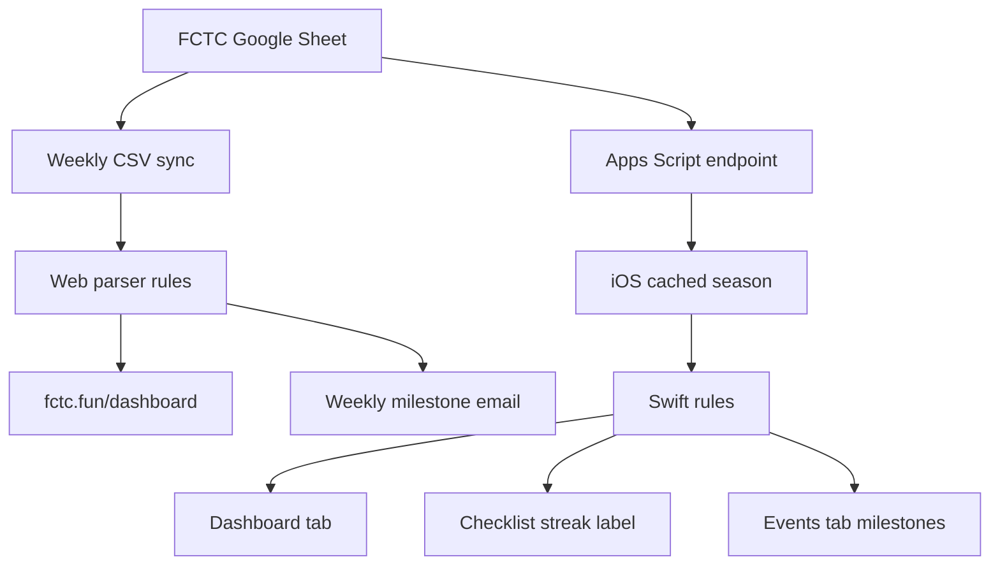
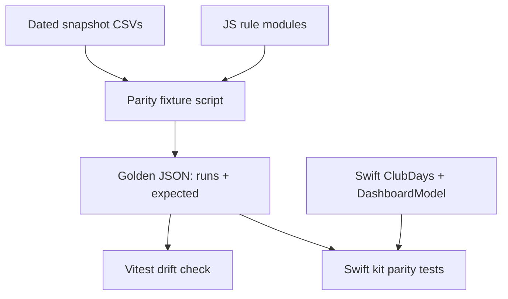
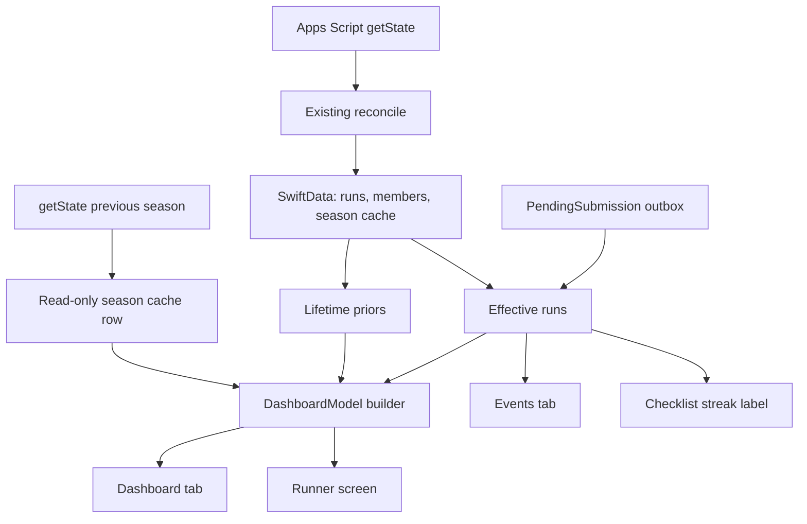
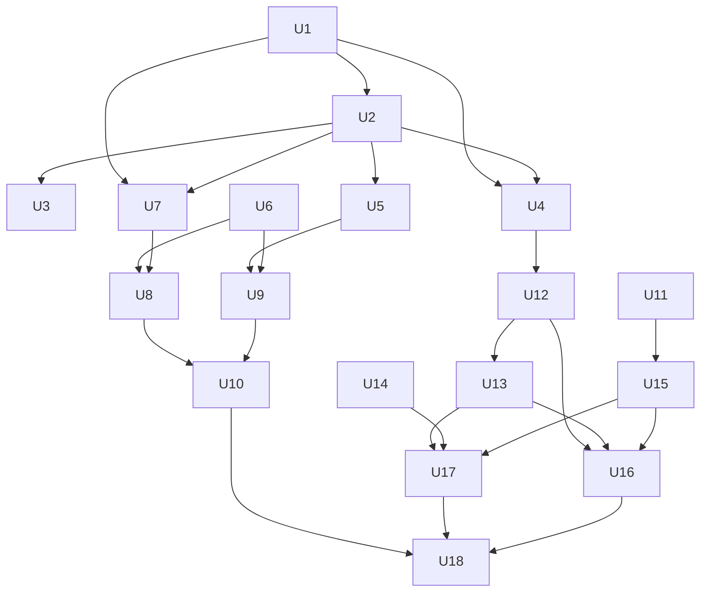

# Dashboard Review and iOS Dashboard - Plan

## Goal Capsule

- **Objective:** Make every club number correct under one set of attendance rules, rebuild the web dashboard as the approved Poster-style quick reference, and give the iOS app a Runs · Events · Dashboard tab bar with the same reference information built natively.
- **Product authority:** Colin. Decisions and mockup approval on 2026-09-28. The approved mockups are in `docs/reference/2026-09-28-dashboard-mockups/`. When this plan and a mockup disagree, the Product Contract wins, then the mockup.
- **Open blockers:** None. The Apps Script half of R1 reaches the app only after Colin redeploys the script (see Dependencies).
- **Execution profile:** Four phases in dependency order: A shared rules, B web, C iOS, D docs and review. Phase B can land without Phase C.
- **Stop conditions:** Stop and ask Colin when the iOS spike (U11) shows neither fallback works, when a golden fixture disagrees with the sheet's own summary row, or before any push, deploy or TestFlight upload.
- **Tail ownership:** Commit on branch `dashboard-review`; do not push. Colin redeploys Apps Script and ships the next TestFlight build.

---

## Product Contract

### Summary

Fix the review bugs so the dashboard, the app and the milestone email agree with the sheet.
Rebuild fctc.fun/dashboard to the approved mockup in the fctc.fun Poster style, with The Wall as its centrepiece.
Add a Liquid Glass tab bar to the iOS app (Runs · Events · Dashboard) that shows the same reference information from the app's own cached season, in the app's existing Reminders look.

### Problem Frame

The dashboard shows numbers the club can't trust.
Since the 18 Sep sync, the sheet's BIRTHDAY row counted as a run, adding one to the season total and to four members.
Annotation cells in 2025 ("🛕", "sad face") count as attendance, although the sheet's own formulas count only "x".
The streak counts every recorded run in a row, so a weekend special or a three-race holiday resets everyone, and nobody knows what the number means.
Run links open the wrong run outside 2026, filters silently change what the headline numbers measure, and several widgets name the same run type three ways.
The full list is in Review findings below.

The dashboard also looks nothing like fctc.fun, which proxies it at `/dashboard`: the hub uses the Poster brand while the dashboard is a grey Tufte page.

Organisers (Colin, Aaron, Grant) use the iOS app at runs, but to look up a number they open the website on their phones.
The app plan of 2026-08-14 deferred in-app stats on the assumption that a web link would do; it doesn't.

### Key Decisions

- **One attendance rule set, in every reader of the sheet.** The web parser (dashboard and milestone email) and Apps Script (the iOS app) apply identical rules. Divergence between them is how the BIRTHDAY bug shipped.
- **A streak counts the season's official club days.** 2026 runs officially on Monday, Wednesday and Friday; 2025 ran on Wednesday and Friday only. Any run on a club day counts. Runs on other days neither add nor break a streak. A holiday special on an official club day (Invasion Day on Mon 26 Jan 2026, the Good Friday pancake run) counts as that day's club run.
- **The web dashboard is a quick reference, not a story.** Charts can be inventive in form, but there is no scrollytelling.
- **The approved mockup is the web design spec.** fctc.fun Poster tokens (crema and espresso, pink hero, gold bibs, sock stripe; Anton, Archivo and Space Mono; square 2px rules) in light and dark.
- **The Wall replaces three charts.** It supersedes the sparkline table, the calendar heatmap and the slopegraph. The donut, the attendance-by-type line chart and the run-type small multiples go too.
- **Filters belong to the run log.** Headline numbers and charts always describe the whole selected season, so a filter can never change what a headline measures.
- **The iOS Dashboard computes from the app's cached season.** It works offline and reflects a run the moment it is recorded, where the web waits for the weekly sync. The cost is that the rules exist in JavaScript and Swift, so shared fixtures must hold both to the same numbers.
- **iOS keeps its Reminders look.** The app takes the approved structure (tabs, cards, charts, runner screen) but keeps system colours, the user-selected accent and SF Pro. No brand palette or Anton in the app.

How the sheet reaches each surface, and why the rules must match in both paths:

### Requirements

**Attendance rules (shared by web and iOS)**

- R1. Only a member cell whose trimmed value is "x" (any case) counts as attended, in the web parser and in Apps Script.
- R2. A run is a row whose first cell is a real run date and that has at least one attendee or +1; metadata rows such as BIRTHDAY never count.
- R3. Sheet footnote markers never create a separate run type ("**Cruise" is "Cruise").
- R4. A club day is a date on one of the season's official club weekdays (2025: Wednesday and Friday; 2026: Monday, Wednesday and Friday) with at least one run, and a member makes it by attending any run that day.
- R5. A member's current streak is the number of consecutive most-recent club days they made. The web, the iOS Dashboard and the iOS checklist streak label all use this rule.
- R6. Month-bucketed series run from the first to the latest run month and keep seasons apart in All time.
- R7. Run types and locations are normalized once, and every widget, filter and colour uses the normalized names.

**Web dashboard**

- R8. The page matches the approved mockup and the fctc.fun Poster tokens in light and dark.
- R9. Sections, in order: title band with year switcher and meta row; headline numbers with a same-date comparison to the previous season; On a roll beside the leaderboard; The Wall; Every run; Vs last year; Milestones ahead; Run log.
- R10. On a roll lists current streaks, the season-best streaks with dates, and the streak rule in one plain sentence.
- R11. The Wall shows every active runner against every run of the selected period, with each runner's current streak and every non-club-day special marked.
- R12. The Wall sorts by runs, streak or name, highlights one runner on "find yourself", and opens on the latest runs when it scrolls sideways on a phone.
- R13. Every run shows one mark per runner, grouped into Monday, Wednesday, Friday and Specials tracks, with each track's busiest day labelled.
- R14. Vs last year plots cumulative member-kilometres for the selected season against the previous season, labelling the gap at the latest run; it is hidden when no previous season exists.
- R15. The run log owns the type, location, month and search filters, and switching year resets them.
- R16. A run link identifies the run stably and keeps the selected year, so every row opens the right run in every view, including All time.
- R17. Removed charts leave no unused code or tokens behind.
- R18. Every chart offers hover detail and stays readable without hover.

**iOS app**

- R19. A Liquid Glass tab bar with Runs, Events and Dashboard.
- R20. Runs keeps today's run and recording, the This week and Unsynced tiles, Season and Past runs, and the Settings gear.
- R21. Notification and App Intent routes that open a checklist land on the Runs tab.
- R22. Events lists this week's upcoming club runs, upcoming specials (runs sharing a date grouped as one), milestones and birthdays. Milestones and birthdays move off Runs.
- R23. Dashboard shows, for the current season, cards in the order of the approved mockup: the headline card (runs or km, with runners per recent run), km together against last season, On a roll, The Wall (recent weeks, top runners), Vs last year, Every run, Leaderboard (runs or km) and the Run log.
- R24. The Wall card opens a full Wall, and tapping a runner anywhere opens their runner screen.
- R25. The runner screen shows runs, km and current streak, a club-day season calendar with the streak marked, club days made per weekday, and the all-time total with the next milestone.
- R26. Dashboard and Events read from the app's cached data, work offline, and update as soon as attendance is recorded.
- R27. The app keeps its current look: system colours, the user-selected accent, SF Pro and standard dark mode.

**Parity**

- R28. For the same season data, web and iOS produce identical runs, km, member totals, club days and streaks, proven by tests over shared fixtures.

### Acceptance Examples

- AE1. **Covers R4, R5.** **Given** Aaron made every club day from Wed 26 Aug to Fri 25 Sep 2026 and also ran the Sat 5 Sep Pub Run, **then** his current streak is 14. The Pub Run neither adds nor breaks it.
- AE2. **Covers R4.** **Given** Mon 26 Jan 2026 had a Half and a 10k, **when** a member ran only the 10k, **then** they made that club day.
- AE3. **Covers R5.** **Given** the Sun 13 Dec Xmas Mara, Half and 10k, **when** a member skips all three, **then** their streak is unchanged.
- AE4. **Covers R2.** **Given** the 2026 sheet with its BIRTHDAY row, **then** the season has 118 runs and Aaron has 89 (the sheet's own summary row agrees).
- AE5. **Covers R1.** **Given** 19 Feb 2025, **then** it has 16 runners (the "🛕" and "sad face" cells don't count), and Adam's 2025 total is 80.
- AE6. **Covers R16.** **When** a viewer opens the 31 Dec 2025 row from the 2025 view, or any 2025 row from All time, **then** that exact run opens and the header still shows the selected year.
- AE7. **Covers R15.** **Given** the run log filtered to Drift in 2026, **when** the viewer switches to 2025, **then** the filters reset and the log lists all 2025 runs. The headline numbers never changed with the filter.
- AE8. **Covers R26.** **When** an organiser records today's attendance, **then** the Dashboard's totals and streaks include it before any sync, including offline.
- AE9. **Covers R4, R5.** **Given** 2025 had no official Monday runs, **then** the Invasion Day runs on Mon 27 Jan 2025 are specials: 2025 has 104 club days, Scott's season-best streak is 54 (3 Jan to 9 Jul), and he ends 2025 on 49.

### Review Findings

Confirmed on 2026-09-28 against the committed CSVs.

| # | Finding | Where | Requirement |
|---|---|---|---|
| 1 | BIRTHDAY row counted as a run; a test put the label in the wrong column | `src/utils/dataParser.js` | R2 (fixed in working tree) |
| 2 | Sparklines drew future months as zero; All time merged both years into Jan to Dec | `src/utils/dashboardMetrics.js` | R6 (fixed in working tree) |
| 3 | "**Cruise" became its own run type | `src/utils/dataParser.js` | R3 (fixed in working tree) |
| 4 | Run links index into the wrong year; All time shows "Run not found" for 2025 | `src/pages/RunDetail.jsx`, `src/components/Dashboard/RunsTable.jsx` | R16 |
| 5 | Annotation cells count as attendance, in the web parser and Apps Script | `src/utils/dataParser.js`, `apps-script/SheetOps.js` | R1 |
| 6 | Filtered headline distance switches from member-km to route-km | `src/pages/Dashboard.jsx` | R15 |
| 7 | Multi-run days and weekend specials break streaks | `src/utils/dashboardMetrics.js`, `ios/FCTCAttendanceKit/ViewModels/AttendanceInsights.swift` | R4, R5 |
| 8 | Filters persist across a year switch and empty every chart | `src/pages/Dashboard.jsx` | R15 |
| 9 | Run type and location names split three ways; badge colours use the wrong key | `src/utils/theme.js`, `src/utils/runTypeColors.js`, `src/components/Dashboard/RunsTable.jsx` | R7 |
| 10 | All-time slopegraph compares halves of unequal size | `src/utils/dashboardMetrics.js` | R17 (chart removed) |
| 11 | Attendance chart hardcodes its type list and omits Cruise | `src/components/Dashboard/AttendanceChart.jsx` | R17 (chart removed) |
| 12 | Run detail prints a literal "0" when a run has no km | `src/pages/RunDetail.jsx` | R16 |
| 13 | Run links and header links leave `/dashboard` under the fctc.fun proxy, so shared links land on the hub | `src/components/Layout/Header.jsx`, `src/App.jsx` | R16 |

### Scope Boundaries

- Wrapped (pinned to 2025), the milestone email's design and home-screen widgets stay as they are. Wrapped's numbers follow R1, and its own streak slide keeps its old rule.
- The app does not adopt the Poster palette, Anton or square corners.
- The iOS Dashboard has no season picker; 2025 and All time views stay on the web.
- The sheet itself is not edited; the rules ignore its annotation cells.
- No narrative or scrollytelling layer on the web.

#### Deferred to Follow-Up Work

- The next TestFlight build (build 9) with rhyming release notes, once Colin has used the tabs.
- A `docs/solutions/` entry on keeping attendance rules in step across the parser and Apps Script (run `/ce-compound` after this lands).
- Open iOS review findings from 2026-09-28 that this plan does not touch (background-drain cancellation, guest queue blocking, early-rejection receipts).

### Dependencies / Assumptions

- The Apps Script part of R1 reaches the app only after Colin runs `clasp push` and `clasp deploy -i <existing-id>` (`apps-script/README.md`, "Deploy runbook"). Until then the app's all-time totals stay one or two runs higher for Adam, Alex 👑, Rhys, Rohan and Toby.
- Nobody records a per-person distance in a member cell (confirmed by Colin); the CSVs hold only "x", "-", the 2025 annotations and the BIRTHDAY row.
- The weekly sync already reads every season through the production Apps Script, so the endpoint can serve 2025 for the iOS Vs last year card. Endpoints that can't serve a past season hide that card.
- The web keeps reading the committed CSVs; the weekly sync is unchanged.

### Sources / Research

- Approved mockups and their data generator: `docs/reference/2026-09-28-dashboard-mockups/` (open `index.html` through the dev server; `make-data.mjs` rebuilds `data.js` and already implements the club-day streak).
- Brand tokens: `fctc-site/src/styles/tokens.css` and `fctc-site/docs/plans/design_handoff_poster_redesign/README.md` in the sibling repo. fctc-site loads its fonts with `@fontsource/anton`, `@fontsource-variable/archivo` and `@fontsource/space-mono`.
- Chart palette validated with the dataviz checker for colour-vision deficiency: pink `#d75b77` with gold `#c79311` on crema, and `#b98810` on espresso. Gold marks always carry a text label because their contrast on crema is 2.5:1.
- Superseded direction: `docs/plans/2026-05-28-001-feat-fctc-dashboard-2026-redesign-plan.md` (Tufte redesign). Earlier deferral of in-app stats: `docs/plans/2026-08-14-001-feat-fctc-attendance-ios-app-plan.md`.

---

## Planning Contract

**Product Contract preservation:** changed: R2, R4 and R14 (clarifications from research and Colin's 2026-09-28 answers: a run needs an attendee or +1, club weekdays are per season, Vs last year hides without a previous season); added AE9 and review finding 13. Scope is otherwise unchanged.

### Key Technical Decisions

- KTD1. **Two small pure JS rule modules own the rules.** `src/utils/runLabels.js` parses run labels into a type and an event ("Half - Xmas" and "Half- Invasion Day" become type "Half Marathon", event "Xmas" or "Invasion Day"), maps location aliases ("Some-day" is "Someday"), and builds run ids. `src/utils/clubDays.js` builds club days, streaks and the milestone shortlist. Both are dependency-free and Node-safe, because the weekly workflow imports the parser after `npm ci --omit=dev`. Every relative import in `dataParser.js`, `runLabels.js`, `clubDays.js` and `years.js` uses an explicit `.js` specifier, because plain Node ESM rejects the extensionless imports Vitest accepts.
- KTD2. **Club weekdays are season config.** `src/config/years.js` records each season's club weekdays (2025: Wed, Fri; default Mon, Wed, Fri). The Swift kit mirrors the same table. Rule functions take the weekday set as a parameter so tests can pin it.
- KTD3. **Parity runs on golden JSON, not a Swift CSV parser.** A Node script turns the dated snapshot `fixtures/attendance/2026-09-27/*.csv` into `fixtures/attendance/parity/<year>.json`: runs with their raw `run` and `meet` labels and their normalized fields (ISO date, weekday, type, event, location, km, attendees, +1s), plus the expected totals, club days, streaks and milestones. Vitest fails when the committed JSON drifts from the script. Swift tests parse each raw label with `RunLabel` and compare it with the golden type, event and location, then recompute from the runs and compare with the expected block. The iOS test bundle already includes `fixtures/attendance`.
- KTD4. **Run ids are `YYYY-MM-DD-<slug of the run label>`.** Neither season has two runs with the same date and label; a collision gets a `-2` suffix. An id resolves inside its own season whatever `?year` says; `?year` only drives the header and the back link. Old numeric ids show "Run not found" with a link back.
- KTD5. **The web loads every season once.** All CSVs together are about 26 KB. Headline deltas, Vs last year and all-time milestones then need no extra fetches, and Wrapped reads 2025 from the same store.
- KTD6. **Poster styles live in their own namespace.** Wrapped's Tailwind tokens reuse the names `pink`, `espresso`, `cream` and `--font-display` with different values and a bold weight Anton lacks. The dashboard gets `src/styles/poster.css`, scoped to a `.poster` root, with brand variables for light (default) and dark (`[data-theme="dark"]`). Fonts come from the same `@fontsource` packages as fctc-site so Vite emits them under `/assets/`, which the hub already proxies.
- KTD7. **One theme toggle across fctc.fun.** The dashboard reads and writes `localStorage.theme` and `data-theme` on `<html>`, as the hub does, with a no-flash inline script in `index.html`. It falls back to `prefers-color-scheme`.
- KTD8. **Charts are hand-rolled SVG React components over pure data functions.** Every chart gets a tested builder in `src/utils/dashboardMetrics.js` and a thin render component, as the mockup does. Recharts and `react-activity-calendar` are removed.
- KTD9. **Links respect the mount point.** A base-path helper returns `/dashboard` when the page is served under the hub and `''` otherwise. Routes add `/dashboard/run/:runId`. Run-log filters live in the URL so Back restores them; "find yourself" lives in `localStorage`.
- KTD10. **iOS: one pure `DashboardModel` computed once per data change.** A UI-free kit builder turns effective runs, members and lifetime priors into every card's data. An observable store rebuilds it when a fingerprint (cached runs, pending submissions, season) changes, never per render. This avoids adding another per-render SwiftData fetch and JSON decode.
- KTD11. **iOS: effective runs = cached season plus the outbox.** Recorded attendance sits in `PendingSubmission` until the server confirms it. A kit function applies pending submissions to the cached runs in creation order, skipping conflicted and failed ones. It follows each endpoint's own write path: the legacy `finish()` merge and overwrite rules for legacy endpoints, and the shared path (`drainSharedAttendance` plus Apps Script `guestAttendancePlan_`) for shared endpoints, where +1s come from named plus unnamed guests. A confirmed shared submission stays in the overlay until the next successful refresh after its confirmation, so a failed follow-up refresh never drops the run. Dashboard, Events and the checklist streak all read it. Cards show "Includes N unsynced" when N > 0.
- KTD12. **iOS: all-time = prior seasons + live season.** For each member, prior runs = `lifetimeTotals` minus that member's runs in the same cached payload. All-time = prior runs + the effective current-season count. No SwiftData schema change.
- KTD13. **iOS: last season is a read-only snapshot.** A new engine method calls `getState(seasonSheetId:)` for the previous supported season and upserts only its `SharedSheetCache` row. It never runs `reconcile`, never sets `latestState`, and never touches members, runs or reminders. On a cold launch the engine (`currentSharedState()`) and the app (`activeSheetCache`) pick the same row, `SharedSheetCache.live`: the one the last live refresh returned (`liveAt`), else the highest season year. So neither the snapshot nor a future tab opened by season can become the season that `addRun` and `addMember` write to. The first call on each engine (once per app session) fetches the season again, so a row cached while that season was live catches up; offline, the cached row serves. Legacy endpoints skip it and the card hides.
- KTD14. **iOS: the TabView owns routing.** `AppRootView` holds the selected tab and one navigation path per tab. A pending route selects Runs, pops Runs to root and pushes the checklist, leaving other tabs alone. An engine swap resets every tab's path.
- KTD15. **iOS: check the tab bar against the bottom bar first.** iOS 26 has open bugs with hiding the tab bar on pushed screens and with bottom-bar toolbars inside a TabView. U11 tests both on the real build. The default fallback moves the run picker's search into the navigation bar and keeps Review as a toolbar button.

### High-Level Technical Design

Parity contract across the two stacks:

iOS data flow into the new tabs:

Unit dependencies:

### System-Wide Impact

- **Milestone email:** it reads the parser's member totals, so x-only and the BIRTHDAY fix change who is "close to 50". The digest tests pin other members and keep passing; the next Sunday email uses corrected totals.
- **Wrapped 2025:** totals for Adam, Alex 👑, Rhys, Rohan and Toby drop by one or two. Its design, palette, fonts and streak slide stay as they are; U6 and U10 must not delete tokens or fonts it uses.
- **Apps Script and the app:** `lifetimeTotals` and attendee lists change only on the eight 2025 annotation cells, after Colin redeploys. Write paths treat annotation cells as blank (U3).
- **fctc.fun proxy:** new asset files land under `/assets/`, which the hub already proxies. The new `/dashboard/run/:id` route must exist on the SPA because the hub rewrites `/dashboard/:path+`.
- **iOS cache:** the previous-season row is a second `SharedSheetCache` row per endpoint. `activeSheetState` prefers the active state, then the highest season year, and U14 aligns the engine's cold-launch fallback (`currentSharedState()`) to the same rule, so the older row never becomes active or the target of new runs and members; U14's tests pin both.
- **iOS routes:** notification and App Intent routes now switch tabs. The shared-screenshot offer and the "deferred route" behaviour move with route handling to the root.

### Risks & Mitigations

| Risk | Mitigation |
|---|---|
| iOS 26 tab bar hiding and bottom-bar toolbars misbehave inside a TabView | U11 checks both on the real build before U15; fallback moves the run picker's search to the navigation bar |
| The outbox overlay and the server disagree, double counting a run | U13 characterizes `finish()` first and tests overlay-then-sync equality |
| JS and Swift rules drift again | Golden JSON parity (U4, U12) fails either suite on any drift |
| Fetching last season disturbs the live season | U14 upserts only the cache row and tests that members, runs, reminders and `latestState` are unchanged |
| Poster tokens or fonts leak into Wrapped | Poster styles are scoped to `.poster`; U10 keeps every token and font Wrapped imports; Wrapped is part of the visual review |
| The app shows old totals until the Apps Script redeploy | The final summary and `apps-script/README.md` name the redeploy step; the gap is one or two runs for five members |
| UI tests can't find tab buttons by identifier on iPhone | The tab helper falls back to the tab index |

### Assumptions

- The streak for a finished season (2025) is its value on the last club day, labelled "at season end".
- Single-season views reset streaks at the season start; All time counts across the merged club days of both seasons.
- "Km together" is member-kilometres everywhere (actual km × members, excluding +1s), matching today's headline.
- A run with attendance but no km adds 0 km and shows "—".
- The milestone rule everywhere is the app's `MilestoneBoard`: 10 or fewer runs to the next multiple of 50, top 3 plus ties, over all-time totals through the latest run.
- Names compare after Unicode NFC normalization and trimming on both stacks.

---

## Implementation Units

| U-ID | Title | Key files | Depends on |
|---|---|---|---|
| U1 | Run label, location and id rules | `src/utils/runLabels.js`, `src/utils/dataParser.js` | none |
| U2 | Attendance and club-day rules | `src/utils/clubDays.js`, `src/utils/dataParser.js`, `src/config/years.js` | U1 |
| U3 | Apps Script x-only attendance | `apps-script/SheetOps.js` | U2 |
| U4 | Golden parity fixtures | `scripts/build-parity-fixtures.js`, `fixtures/attendance/parity/` | U1, U2 |
| U5 | Web data store and routing | `src/App.jsx`, `src/pages/RunDetail.jsx`, `src/utils/dashboardPaths.js` | U2 |
| U6 | Poster foundation and chrome | `src/styles/poster.css`, `src/components/Poster/` | none |
| U7 | Dashboard data builders | `src/utils/dashboardMetrics.js` | U1, U2 |
| U8 | Dashboard charts and panels | `src/components/Dashboard/` | U6, U7 |
| U9 | Run log and run detail | `src/components/Dashboard/RunLog.jsx`, `src/pages/RunDetail.jsx` | U5, U6 |
| U10 | Remove the old dashboard | old components, utils, deps | U8, U9 |
| U11 | iOS tab bar spike | `ios/FCTCAttendance/Views/RunPickerView.swift` | none |
| U12 | Swift rules and DashboardModel | `ios/FCTCAttendanceKit/ViewModels/` | U4 |
| U13 | Effective runs and live streaks | `ios/FCTCAttendanceKit/ViewModels/EffectiveRuns.swift` | U12 |
| U14 | Previous-season snapshot | `ios/FCTCAttendanceKit/Services/SyncEngine.swift` | none |
| U15 | Tab shell and Runs tab | `ios/FCTCAttendance/Views/RootTabView.swift`, `HomeView.swift` | U11 |
| U16 | Events tab | `ios/FCTCAttendance/Views/EventsView.swift` | U12, U13, U15 |
| U17 | Dashboard tab and runner screen | `ios/FCTCAttendance/Views/Dashboard/` | U13, U14, U15 |
| U18 | Docs, review page and handoff | `README.md`, `ios/HANDOFF.md`, `review/` | U10, U16, U17 |

### Phase A: Shared rules

### U1. Run label, location and id rules

**Goal:** One place turns raw sheet labels into a type, an event, a location and a stable run id.

**Requirements:** R3, R7, R16

**Dependencies:** none

**Files:**
- Create: `src/utils/runLabels.js`, `src/utils/runLabels.test.js`
- Modify: `src/utils/dataParser.js`, `src/utils/dataParser.test.js`

**Approach:**
- Parse labels with a pattern for `Mara|Half|10k` followed by an optional-space hyphen and an event name; map the remaining labels through a small alias table ("N/hood Loop" is "N'hood Loop", "FILAMENT CUP 🏆" is "Filament Cup", "Good Fri Pancake" is a special named "Good Friday Pancake Run").
- Strip footnote asterisks (already in the working tree) inside the label parser rather than the parser loop.
- Location aliases: "Some-day" is "Someday"; unknown locations pass through trimmed.
- The parser stamps `type`, `event`, `location` and `id` on each run and keeps `runType` and `meet` unchanged for Wrapped.
- Replace the private `normalizeRunType`; `runsByType` keys use the new type.

**Patterns to follow:** the pure-function style and JSDoc of `src/utils/dashboardMetrics.js`.

**Test scenarios:**
- "Half - Xmas", "Half- Invasion Day" and "Half - Anzac Day" give type "Half Marathon" with events "Xmas", "Invasion Day", "Anzac Day".
- "Mara- Anzac Day" gives "Marathon" and "Anzac Day"; "10k - Xmas" gives "10K" and "Xmas".
- "**Cruise" gives "Cruise" with no event; "Cruise" and "**Cruise" share a type.
- "Some-day" and "Someday" give the same location.
- Run id for Fri 25 Sep 2026 River Loop is `2026-09-25-river-loop`; two runs on Sun 13 Dec get distinct ids by label; a forced collision gets `-2`.
- Parser output for the 2026 fixture has no run without an id, and `runsByType` has one Cruise key.

**Verification:** every run in both public CSVs has a unique id and a type from the known list.

### U2. Attendance and club-day rules

**Goal:** The parser counts only "x", drops non-runs, and the dashboard can compute club days and streaks per season.

**Requirements:** R1, R2, R4, R5, R28; covers AE1–AE5, AE9

**Dependencies:** U1

**Files:**
- Create: `src/utils/clubDays.js`, `src/utils/clubDays.test.js`, `fixtures/attendance/2026-09-27/2025.csv`, `fixtures/attendance/2026-09-27/2026.csv`
- Modify: `src/utils/dataParser.js`, `src/utils/dataParser.test.js`, `src/config/years.js`, `src/config/years.test.js`

**Approach:**
- Parser: a member attends when the trimmed cell lowercases to "x"; a dated row needs at least one attendee or +1 (drop the "km but no attendance" branch).
- Parser applies NFC normalization and trimming to member names.
- `years.js` gains a per-season club weekday table and a lookup with a Mon/Wed/Fri default.
- `clubDays.js`: build ordered club days from runs and a weekday set; compute per member the current streak (with start date), the best streak (with dates), and the made-days count per weekday; compute the milestone shortlist (10 or fewer to go, top 3 plus ties) from all-time totals.
- All time merges per-season club days, each season with its own weekday set.

**Execution note:** start with failing tests for AE1–AE5 and AE9 over a dated snapshot of `public/data` copied to `fixtures/attendance/2026-09-27/`, so the BIRTHDAY row and 2025 annotations are both present. Existing tests keep the older fixtures.

**Patterns to follow:** `docs/reference/2026-09-28-dashboard-mockups/make-data.mjs` (`clubDays`, `streaks`).

**Test scenarios:**
- Covers AE4. The 2026 snapshot with its BIRTHDAY row has 118 runs; Aaron has 89.
- Covers AE5. 19 Feb 2025 has 16 attendees; Adam's 2025 total is 80, Alex 👑 82, Rhys 29, Rohan 8, Toby 46.
- "X" and " x " count; "🛕", "sad face", "-" and "12.30" do not.
- Covers AE1. Aaron's 2026 current streak is 14 from 26 Aug; the Sat 5 Sep Pub Run neither adds nor breaks it.
- Covers AE2. A member who ran only the 26 Jan 2026 10k made that club day.
- Covers AE3. A member who skips an all-Sunday special keeps their streak.
- Covers AE9. 2025 has 104 club days; Scott's best is 54 (3 Jan to 9 Jul) and his season-end streak is 49.
- A blank past row (Fri 8 May 2026) is not a run and not a club day.
- All time: a streak ending 31 Dec 2025 continues into 2 Jan 2026.
- Milestone shortlist on current totals returns Col, Claire and Adam, and keeps ties at the cut.

**Verification:** parser totals match each season's summary row in the CSV for every member.

### U3. Apps Script x-only attendance

**Goal:** Apps Script counts attendance exactly as the web parser does.

**Requirements:** R1

**Dependencies:** U2

**Files:**
- Modify: `apps-script/SheetOps.js`, `apps-script/test/sheetops.checks.js`, `apps-script/README.md`

**Approach:**
- `isAttendedMark` returns true only for a trimmed, case-insensitive "x"; rewrite its comment and the `attendanceTotals` comment, which claim per-person distances.
- Check the write paths that call it (`buildRowWrite` overwrite mode, guest promotion) so an annotation cell is treated like blank: ticking that member writes "x"; unticking leaves the annotation.
- README: add the redeploy step to the release notes for this change.

**Test scenarios:**
- Replace "counts any mark except blank and '-'" with x-only: "x", "X", " x " count; "12.30", "🛕", "no run", "-" and blank do not.
- 2025 lifetime totals: Adam 74 → 72 and Alex 👑 75 → 74 in the existing fixture assertions (update the expected values).
- Overwrite mode on a row where a member cell holds "🛕": ticking writes "x"; not ticking keeps "🛕".
- Guest promotion into a cell holding an annotation writes "x".

**Verification:** `node --test apps-script/test` passes; the digest and snapshot tests still pass.

### U4. Golden parity fixtures

**Goal:** One generated contract that both stacks test against.

**Requirements:** R28

**Dependencies:** U1, U2

**Files:**
- Create: `scripts/build-parity-fixtures.js`, `scripts/build-parity-fixtures.test.js`, `fixtures/attendance/parity/2025.json`, `fixtures/attendance/parity/2026.json`
- Modify: `fixtures/attendance/README.md`

**Approach:**
- The script parses the dated snapshot CSVs (`fixtures/attendance/2026-09-27/`) with the web parser and writes per season: club weekdays, runs (raw `run` and `meet` labels plus normalized fields), member totals (runs, member-km), club days, streaks (current, best, dates) and the milestone shortlist.
- Output is sorted and stable so diffs are readable.
- The test regenerates in memory and compares with the committed files.

**Test scenarios:**
- Regenerated JSON equals the committed JSON.
- Every run in the JSON has an ISO date, weekday, raw labels, type and id.
- 2026 JSON has no run dated after the last recorded run.

**Verification:** the JSON files exist, and the iOS test bundle path `fixtures/attendance` includes them.

### Phase B: Web

### U5. Web data store and routing

**Goal:** Load every season once, route runs by stable id under both mount points, and share the hub's theme.

**Requirements:** R12, R15, R16; covers AE6, AE7

**Dependencies:** U2

**Files:**
- Create: `src/utils/dashboardPaths.js`, `src/utils/dashboardPaths.test.js`
- Modify: `src/App.jsx`, `src/App.test.jsx`, `src/pages/RunDetail.jsx`, `index.html`

**Approach:**
- One loader fetches every season in `YEARS` in parallel; the selected view is a season or the merged All time; Wrapped reads 2025 from the same store.
- Routes: `/`, `/dashboard`, `/run/:runId`, `/dashboard/run/:runId`, and the existing Wrapped routes.
- `dashboardPaths.js`: base path from the current pathname; builders for dashboard, run and back links that keep `year` and the run-log filters.
- RunDetail resolves the id against the run's own season; unknown ids show "Run not found" with a back link.
- `index.html`: an inline script sets `data-theme` from `localStorage.theme`, falling back to the OS scheme.

**Test scenarios:**
- Covers AE6. From `?year=2025`, the id `2025-12-31-…` opens that run; from `?year=all`, a 2025 id opens the 2025 run.
- Under `/dashboard`, a run link is `/dashboard/run/<id>?year=…`; at the root it is `/run/<id>?year=…`.
- A numeric id shows "Run not found" and a link back to the dashboard with the same year.
- Covers AE7. Switching year drops `type`, `location`, `month` and `q` from the URL.
- A failed season fetch shows the error screen; loading shows the spinner (update existing App tests).

**Verification:** a shared run link opened fresh through `https://fctc.fun/dashboard/run/<id>` style paths renders in the dev server with the base path simulated.

### U6. Poster foundation and chrome

**Goal:** The dashboard shell matches fctc.fun in light and dark without touching Wrapped's styles.

**Requirements:** R8, R9

**Dependencies:** none

**Files:**
- Create: `src/styles/poster.css`, `src/components/Poster/SiteHeader.jsx`, `src/components/Poster/SeasonTitle.jsx`, `src/components/Poster/HeadlineNumbers.jsx`, `src/components/Poster/Marquee.jsx`, `src/components/Poster/SiteFooter.jsx`, `src/components/Poster/Tooltip.jsx`, `src/components/Poster/Poster.test.jsx`
- Modify: `package.json`, `src/main.jsx`, `src/pages/Dashboard.jsx`, `vercel.json`

**Approach:**
- Add `@fontsource/anton`, `@fontsource-variable/archivo` and `@fontsource/space-mono` (weights 400 and 700) as dependencies; import them from `poster.css`.
- `poster.css` copies the fctc-site token values under `.poster` and `[data-theme="dark"] .poster`, plus the validated chart tokens.
- SiteHeader mirrors the hub: cup logo, FCTC with pink TC, nav (Dashboard, Cup, Wrapped), theme toggle, 2px rule and stripe. Links follow the base-path helper.
- SeasonTitle: kicker, "The 2026 Season" with the year in ink and "Season" in pink, the year segmented control, and the meta row (updated, last run, next run).
- HeadlineNumbers: runs, km together, runners, per run, each with a same-date delta against the previous season when one exists.
- Marquee: gold band with the season's headline facts and the current streak leader; pauses on hover; static under reduced motion.
- `vercel.json`: immutable cache headers for `/assets/(.*)`.

**Test scenarios:**
- SiteHeader under `/dashboard` links to `/dashboard?year=…`; the theme toggle flips `data-theme` and writes `localStorage.theme`.
- HeadlineNumbers shows "+38 on this time in 2025" for the 2026 snapshot and no delta for 2025 and All time.
- Marquee names the member with the longest current streak, not the first member.
- Test expectation for token CSS: none -- visual, verified in the browser review.

**Verification:** the dashboard top matches the mockup at 1440 px and 390 px in both themes; Wrapped renders unchanged.

### U7. Dashboard data builders

**Goal:** Pure, tested data for every new chart and panel.

**Requirements:** R6, R10, R11, R13, R14, R18

**Dependencies:** U1, U2

**Files:**
- Modify: `src/utils/dashboardMetrics.js`, `src/utils/dashboardMetrics.test.js`

**Approach:**
- `headline(view, previous)`: totals and same-date deltas anchored on the month and day of the view's latest run.
- `onARoll(view)`: current streaks (top 5), season bests (top 3 with dates), season-end wording for finished seasons.
- `wallModel(view)`: active members, ordered runs, per cell `ran`, `streak`, `special`, `notOnRoster` (All time, before a member's first season).
- `everyRunTracks(view)`: per club weekday plus Specials, per date columns of members and +1s, the busiest day per track labelled with its event or type; track subtitles use each weekday's most common location.
- `seasonProgress(view, previous)`: cumulative member-km by day of year for both seasons, and the previous season's value at the latest run's date.
- Keep `monthAxis` and `monthAxisLabel` for the run-log month filter; delete builders only the removed charts use.

**Test scenarios:**
- Wall for 2026 has 30 rows and 118 columns; Aaron's last 14 club-day cells are `streak`; the two Saturday specials are `special`.
- Wall for All time marks Dan B, Deano and René as `notOnRoster` before 2026; members with zero runs in the view are absent.
- Every run 2026: the Wednesday track's busiest day is labelled with its type and count; the 26 Jan columns combine the Half and 10k runners.
- Every run 2025: no Monday track.
- Season progress 2026: final member-km 9,889; 2025 at 25 Sep is 8,263.
- On a roll for 2025 says "at season end" and lists Scott 49 first.

**Verification:** builder outputs for both snapshots match the mockup's `data.js` numbers.

### U8. Dashboard charts and panels

**Goal:** The approved sections render from the builders, with hover detail and readable defaults.

**Requirements:** R9, R10, R11, R12, R13, R14, R18

**Dependencies:** U6, U7

**Files:**
- Create: `src/components/Dashboard/OnARoll.jsx`, `src/components/Dashboard/TheWall.jsx`, `src/components/Dashboard/EveryRun.jsx`, `src/components/Dashboard/VsLastYear.jsx`, `src/components/Dashboard/MilestoneBibs.jsx` and a colocated test for each
- Modify: `src/components/Dashboard/Leaderboard.jsx`, `src/pages/Dashboard.jsx`

**Approach:**
- Follow `web.html` for layout, colours and copy; replace inline DOM building with React SVG.
- TheWall: HTML name and totals columns with a scrollable SVG grid between them; measure the grid after the names render; scroll to the latest runs on first render and on a year switch only; a single print-in sweep on load, off under reduced motion.
- Above the Wall, as in the mockup: a sort select (most runs, current streak, A–Z) and a "Find yourself…" select listing the view's active runners A–Z. Choosing a runner highlights their row and dims the rest; the choice persists in `localStorage` and survives a year switch when that runner is active in the new view.
- EveryRun: one SVG per track sharing the date scale; hollow dots for +1s; the busiest day in pink with its label.
- VsLastYear: previous season in muted ink, current in pink, labelled end points and the gap at the latest run; month labels thin to quarters under 600 px; hidden without a previous season.
- Leaderboard: runs or km toggle, outlined Anton ranks, top 10.
- MilestoneBibs: the shortlist as gold bibs, or "No one's close to a milestone yet" when the shortlist is empty.
- One shared `Tooltip` component (from U6) serves every chart. It opens on mouse hover and on keyboard focus of a mark, with the same date, run and runner detail.
- Every chart exposes its values without hover: direct labels, totals columns, or an accessible table.

**Test scenarios:**
- TheWall renders one row per active member and highlights the chosen member; sorting by streak puts Aaron first for 2026.
- TheWall keeps its scroll position when sorting.
- EveryRun renders four tracks for 2026 and three for 2025.
- VsLastYear is absent for 2025 and All time.
- MilestoneBibs shows Col, Claire and Adam for the current totals, and the empty-state text for an empty shortlist.
- Tabbing to a Wall cell or an Every run column shows the same tooltip as hovering it.
- Each chart has an accessible name; hover tooltips show date, run and runner count.

**Verification:** side-by-side with the mockup at 1440 px and 390 px, light and dark, no horizontal page scroll on phones.

### U9. Run log and run detail

**Goal:** A filterable, searchable run log and a Poster-style run page.

**Requirements:** R15, R16; covers AE6, AE7; fixes review findings 4, 6, 8, 12

**Dependencies:** U5, U6

**Files:**
- Create: `src/components/Dashboard/RunLog.jsx`, `src/components/Dashboard/RunLog.test.jsx`
- Modify: `src/pages/RunDetail.jsx`, `src/pages/RunDetail.test.jsx` (create if absent)

**Approach:**
- Filters (type, location, month, search) read and write URL params; month options show "Jan 2025" and "Jan 2026" in All time.
- Rows show date, type tag (gold for specials), location, km (or "—"), runner dots and count; rows link by run id.
- Show 10 rows with "Show all N runs".
- RunDetail: date, type and event, location, km, runners (members then +1s), member-km, back link to the same view.

**Test scenarios:**
- Filtering to Drift in 2026 shows only Drift runs and leaves the headline untouched.
- Search matches type, location, date and runner name.
- A run with no km shows "—", never "0".
- Back from a run restores the same filters.

**Verification:** every row in both seasons opens its own run page.

### U10. Remove the old dashboard

**Goal:** No dead components, utilities, tokens or dependencies remain.

**Requirements:** R17

**Dependencies:** U8, U9

**Files:**
- Delete: `src/components/Dashboard/AttendanceChart.jsx`, `RunTypeBreakdown.jsx`, `StatsCards.jsx`, `FilterBar.jsx`, `RunsTable.jsx`, the whole `src/components/Dashboard/viz/` folder (including the already-dead `DotPlot`), `src/utils/chartConfig.js`, `src/utils/runTypeColors.js`, `src/utils/useThemeColors.js`
- Modify: `src/utils/theme.js` (drop `dashboardColors*`, `dataColors*`, unused palettes and motion variants; keep what Wrapped imports), `src/index.css` (drop dashboard-only tokens, `.card-clean`, the dark block and dead utilities), `src/test/setup.js` (drop the `CSS.supports` stub), `package.json` (remove `recharts`, `react-activity-calendar`), `src/components/Layout/Header.jsx` (delete if nothing imports it)

**Approach:** delete, then let the build and test suite name every leftover import.

**Test expectation:** none -- removal only; the full suite and build prove nothing still imports the deleted code.

**Verification:** `npm run build` succeeds, the bundle no longer contains Recharts, and Wrapped pages render as before.

### Phase C: iOS

### U11. iOS tab bar spike

**Goal:** Decide how the run picker's bottom bar coexists with the tab bar on the real iOS 26 build.

**Requirements:** R19, R20

**Dependencies:** none

**Files:**
- Modify: `ios/FCTCAttendance/Views/RunPickerView.swift` (throwaway branch of the change is fine; keep only the chosen approach)

**Approach:**
- Wrap the current Home in a minimal three-tab TabView in a scratch commit.
- Push the run picker and test `.toolbarVisibility(.hidden, for: .tabBar)` with its bottom-bar search and Review.
- If hiding is unreliable, move search into the navigation bar and Review into the top toolbar.
- Record the outcome in the plan's Deferred Implementation Notes before U15.

**Test expectation:** none -- a decision spike; U15's UI tests cover the chosen behaviour.

**Verification:** screenshots of the pushed run picker on iPhone 17 Pro, light and dark, show one bottom bar and working search.

### U12. Swift rules and DashboardModel

**Goal:** A UI-free Swift mirror of the JS rules and one builder for every Dashboard card.

**Requirements:** R4, R5, R23, R25, R28

**Dependencies:** U4

**Files:**
- Create: `ios/FCTCAttendanceKit/ViewModels/RunLabel.swift`, `ios/FCTCAttendanceKit/ViewModels/ClubDays.swift`, `ios/FCTCAttendanceKit/ViewModels/DashboardModel.swift`, `ios/FCTCAttendanceKitTests/RunLabelTests.swift`, `ios/FCTCAttendanceKitTests/ClubDaysTests.swift`, `ios/FCTCAttendanceKitTests/DashboardModelTests.swift`, `ios/FCTCAttendanceKitTests/ParityFixtureTests.swift`
- Modify: `ios/FCTCAttendanceKit/ViewModels/AttendanceInsights.swift`, `ios/FCTCAttendanceKitTests/AttendanceFeatureTests.swift`, `ios/FCTCAttendance/Views/ChecklistComponents.swift`, `ios/project.yml` (confirm the fixtures folder and the `.impeccable` exclusion cover new files)

**Approach:**
- `RunLabel`: the same label and location tables as `runLabels.js`.
- `ClubDays`: season weekday table (2025: Wed, Fri; default Mon, Wed, Fri), club days from runs in the Perth calendar, streaks with dates, made-days per weekday.
- `DashboardModel`: headline, On a roll, Wall (recent five weeks and full), Every run (recent runs), season progress (with an optional previous season), leaderboard (runs and km), milestones via `MilestoneBoard`, runner detail. All-time uses lifetime priors (KTD12).
- `MemberStats` streak switches to club days; the checklist label reads "N club days in a row".

**Test scenarios:**
- Parity: for each golden JSON, Swift totals, member-km, club days, current and best streaks, and the milestone shortlist equal the expected block.
- Parity: `RunLabel` parses every golden run's raw `run` and `meet` labels into the golden type, event and location.
- Label parsing matches the JS cases in U1.
- A future Monday (no attendance) is not a club day and does not break a streak.
- Lifetime priors: a member with lifetime 177 and 89 runs in the payload has prior 88; one new effective run makes all-time 178.
- `MemberStats` returns the club-day streak for Aaron on the 2026 fixture.

**Verification:** the kit scheme's tests pass, including the parity suite.

### U13. Effective runs and live streaks

**Goal:** Recorded attendance shows everywhere before the server confirms it.

**Requirements:** R26; covers AE8

**Dependencies:** U12

**Files:**
- Create: `ios/FCTCAttendanceKit/ViewModels/EffectiveRuns.swift`, `ios/FCTCAttendanceKitTests/EffectiveRunsTests.swift`
- Modify: `ios/FCTCAttendance/Views/ChecklistView.swift`

**Approach:**
- Apply outstanding `PendingSubmission`s to the cached runs in creation order, matching by run identity or row index; skip conflicted and failed submissions.
- Legacy endpoints follow the `finish()` merge and overwrite semantics. Shared endpoints follow `drainSharedAttendance` and the Apps Script guest plan, deriving +1s from named plus unnamed guests.
- Keep a confirmed shared submission in the overlay until the next successful refresh after its confirmation.
- Return the effective runs plus the count of unsynced submissions applied.
- The checklist streak and the Dashboard both read effective runs.

**Execution note:** write characterization tests of both write paths first (legacy `finish()`, and the shared drain plus guest plan), then make the overlay match them.

**Test scenarios:**
- Covers AE8. A pending overwrite for today adds Aaron; his streak and totals include it with the network off.
- A pending merge adds to existing attendees without removing any.
- A conflicted submission is ignored; a later confirmed server state replaces the overlay without double counting.
- Two pending submissions for the same run apply in order.
- Shared endpoint: a submission with two named guests and one unnamed guest shows 3 +1s, matching the server's guest plan.
- Shared endpoint: a confirmed submission whose follow-up refresh fails still counts until a later refresh succeeds.

**Verification:** the overlay's result equals the server state after the same submissions sync.

### U14. Previous-season snapshot

**Goal:** Fetch last season once for Vs last year without touching the live season.

**Requirements:** R14, R23

**Dependencies:** none

**Files:**
- Modify: `ios/FCTCAttendanceKit/Services/SyncEngine.swift`, `ios/FCTCAttendanceKit/Services/SharedGuestSync.swift`
- Create: `ios/FCTCAttendanceKitTests/SeasonSnapshotTests.swift`

**Approach:**
- New engine method: when the endpoint lists a previous supported season and no cache row exists, call `getState(seasonSheetId:)` and upsert only that season's `SharedSheetCache` row.
- Never call `reconcile`, never set `latestState`, never reschedule reminders.
- Change the `currentSharedState()` fallback in `SharedGuestSync.swift` from the newest `refreshedAt` row to the endpoint's row with the highest season year.
- Legacy endpoints return "unavailable"; the Dashboard hides the card.

**Test scenarios:**
- After the fetch, the active season, `latestState`, members, scheduled runs and pending reminders are unchanged.
- A freshly created engine (cold launch, empty `latestState`) returns the live season from `currentSharedState()` after the snapshot fetch, so an offline `addRun` targets the live season's tab.
- A second call makes no request when the row exists.
- A legacy endpoint makes no request.
- A failed request leaves no partial row.

**Verification:** the UI-test shared API (which already serves two seasons) shows the Vs last year card.

### U15. Tab shell and Runs tab

**Goal:** A Liquid Glass tab bar with Runs, Events and Dashboard, and routes that land on Runs.

**Requirements:** R19, R20, R21

**Dependencies:** U11

**Files:**
- Create: `ios/FCTCAttendance/Views/RootTabView.swift`, `ios/FCTCAttendanceUITests/TabNavigationUITests.swift`
- Modify: `ios/FCTCAttendance/FCTCAttendanceApp.swift`, `ios/FCTCAttendance/Views/HomeView.swift`, `ios/FCTCAttendance/AppRouting.swift`, `ios/FCTCAttendance/Views/RunPickerView.swift`, `ios/FCTCAttendanceUITests/FCTCAttendanceUITests.swift`, `ios/FCTCAttendanceUITests/AttendanceSummaryUITests.swift`, `ios/FCTCAttendanceUITests/ScreenTourUITests.swift`

**Approach:**
- `AppTab` enum and one navigation path per tab in `AppRootView`; `TabView(selection:)` with `Tab` values and accessibility identifiers.
- HomeView becomes the Runs tab root without Milestones and Birthdays; route consumption moves to the root (KTD14); an engine swap resets every path.
- Apply U11's decision to the run picker.
- UI tests use a tab helper that tries the identifier, then the tab index (iPhone tab buttons can ignore identifiers on iOS 26).

**Test scenarios:**
- Launch shows the Runs tab with today's run and the tiles.
- Tapping Events and Dashboard shows their titles; returning to Runs keeps its pushed screen.
- A pending "today's checklist" route from the Dashboard tab switches to Runs and opens the checklist.
- An engine swap returns every tab to its root.
- Existing Home UI tests pass against the Runs tab; milestone and birthday tests move to Events (U16).

**Verification:** the screen tour captures all three tabs in light and dark.

### U16. Events tab

**Goal:** One place for what's coming up.

**Requirements:** R22, R26

**Dependencies:** U12, U13, U15

**Files:**
- Create: `ios/FCTCAttendance/Views/EventsView.swift`, `ios/FCTCAttendanceKit/ViewModels/EventsBoard.swift`, `ios/FCTCAttendanceKitTests/EventsBoardTests.swift`
- Modify: `ios/FCTCAttendance/Views/MilestonesSection.swift`, `ios/FCTCAttendance/Views/BirthdaysSection.swift`, `ios/FCTCAttendanceUITests/AttendanceSummaryUITests.swift`

**Approach:**
- `EventsBoard`: this week's upcoming club runs from cached scheduled rows; upcoming specials (non-club day, or a label with an event) grouped by date with their options ("Mara / Half / 10k"); milestones from effective all-time totals; birthdays from `BirthdayBoard`.
- Reuse the existing sections and their empty text; add "No specials scheduled".

**Test scenarios:**
- On 28 Sep 2026 this week lists Mon 28 Sep, Wed 30 Sep and Fri 2 Oct.
- Specials group the three Sun 13 Dec runs into one row with "Mara / Half / 10k".
- A club-day holiday special (a future Invasion Day) appears under Specials.
- Milestones reflect an unsynced run from the outbox.
- Empty states show when there are no specials, milestones or birthdays.

**Verification:** Events matches the approved structure in the tour screenshots, in the app's own colours.

### U17. Dashboard tab and runner screen

**Goal:** The approved Dashboard cards, full Wall, runner screen and run log in Swift Charts.

**Requirements:** R23, R24, R25, R26, R27

**Dependencies:** U13, U14, U15

**Files:**
- Create: `ios/FCTCAttendance/Views/Dashboard/DashboardView.swift`, `DashboardCards.swift`, `WallView.swift`, `RunnerView.swift`, `RunLogView.swift`, `DashboardStore.swift`, and `ios/FCTCAttendanceUITests/DashboardUITests.swift`

**Approach:**
- `DashboardStore` (`@Observable`) rebuilds `DashboardModel` when the fingerprint changes (KTD10).
- Cards follow the mockup's order and layout in system colours and the user's accent; numbers in SF Pro Rounded bold.
- Wall: `RectangleMark` per cell; the full Wall scrolls horizontally and opens at the latest run via the initial scroll position; tap a name or cell with a spatial tap gesture to open the runner.
- Runner screen: stats, club-day calendar grid, per-weekday bars, all-time progress to the next milestone.
- States: loading and failed states reuse Home's; "Last season not downloaded" for an offline Vs last year; "Includes N unsynced" when the overlay applied submissions.
- VoiceOver labels per mark and a summary per card.

**Test scenarios:**
- Dashboard shows the headline card with the season's run count and the Runs/Km toggle.
- Tapping Aaron on the Wall card opens his runner screen with streak 14.
- The full Wall opens scrolled to the latest run.
- With the network off and one pending submission, the headline and streak include it and the card says "Includes 1 unsynced".
- On a legacy endpoint, Vs last year is hidden.

**Verification:** tour screenshots show every card in light and dark; Instruments shows no per-render SwiftData fetch from the Dashboard.

### Phase D: Docs and review

### U18. Docs, review page and handoff

**Goal:** The docs match the new rules and screens, and Colin has one page to review before and after.

**Requirements:** R8, R19, R28

**Dependencies:** U10, U16, U17

**Files:**
- Modify: `README.md`, `apps-script/README.md`, `ios/HANDOFF.md`, `planning/notes.md`, `src/utils/milestones.js` (comments only if they cite the old rule)
- Create: `review/dashboard-build/index.html` (gitignored)

**Approach:**
- README: data model (x-only, runs, club days per season), dashboard sections, fonts and theme toggle, parity fixtures and how to regenerate them, the Apps Script redeploy step.
- HANDOFF: tabs, Dashboard data flow, tests added.
- Review page: web before/after at desktop and phone, light and dark; iOS tour screenshots per tab; the approved mockups beside the builds.

**Test expectation:** none -- documentation and review artifacts.

**Verification:** every command in the README runs as written.

---

## Verification Contract

| Gate | Command or check | Applies to |
|---|---|---|
| Web unit and component tests | `npm test` | U1, U2, U4–U10 |
| Web build | `npm run build` | U5–U10 |
| Apps Script checks | `node --test apps-script/test` | U3 |
| Plain-Node parser import | `node scripts/send-milestone-digest.js --preview` | U1, U2, U4 |
| Parity drift | `npm test` includes `scripts/build-parity-fixtures.test.js` | U4 |
| iOS project | `xcodegen generate` in `ios/`, then build-for-testing per `docs/plans/packets/U8-release-runbook.md` | U11–U17 |
| iOS kit tests | the `FCTCAttendanceKit` scheme test run from the runbook | U12–U14, U16 |
| iOS UI tests | the `FCTCAttendance` scheme UI tests, plus the screen tour (`README.md`, "screen tour") on iPhone 17 Pro | U15–U17 |
| Visual review | dev server at 1440 px and 390 px, light and dark, against `docs/reference/2026-09-28-dashboard-mockups/` | U6, U8, U9, U17 |

---

## Definition of Done

- Every unit's test scenarios exist and pass, and every gate above is green.
- AE1–AE9 each have a passing test on the stack(s) they cover.
- The web dashboard matches the approved mockup at desktop and phone widths in both themes; Wrapped is unchanged.
- The iOS app shows Runs · Events · Dashboard in its Reminders look, and the tour screenshots are on the review page.
- No removed chart, token, utility or dependency remains, and no abandoned spike code is left in the diff.
- README, `apps-script/README.md` and `ios/HANDOFF.md` describe the new rules, screens and the Apps Script redeploy step.
- Work is committed on `dashboard-review` and not pushed; Colin has the redeploy step in the final summary.

---

## Deferred Implementation Notes

- U11's outcome (hide the tab bar on the pushed run picker, or move its search) is recorded here before U15 starts.
- Exact merge and overwrite details for the outbox overlay come from characterizing the legacy `finish()` step in U13.
